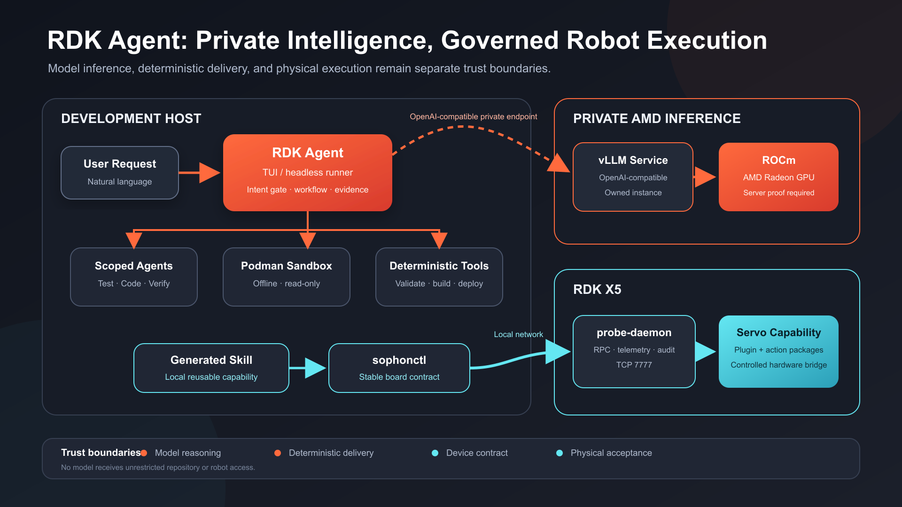
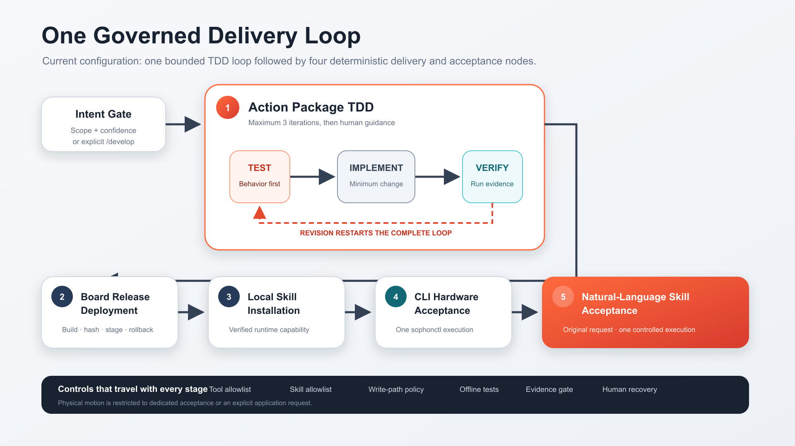
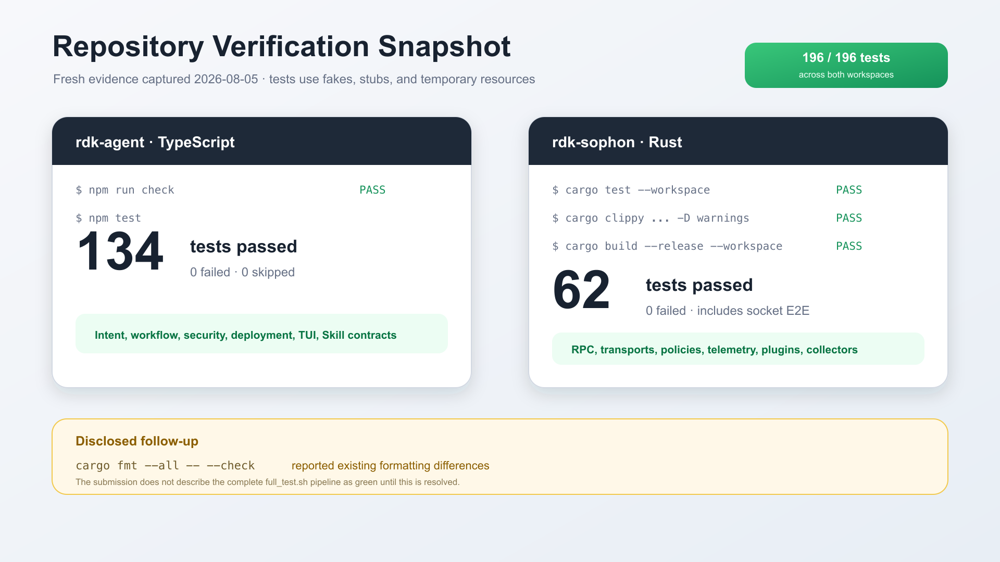
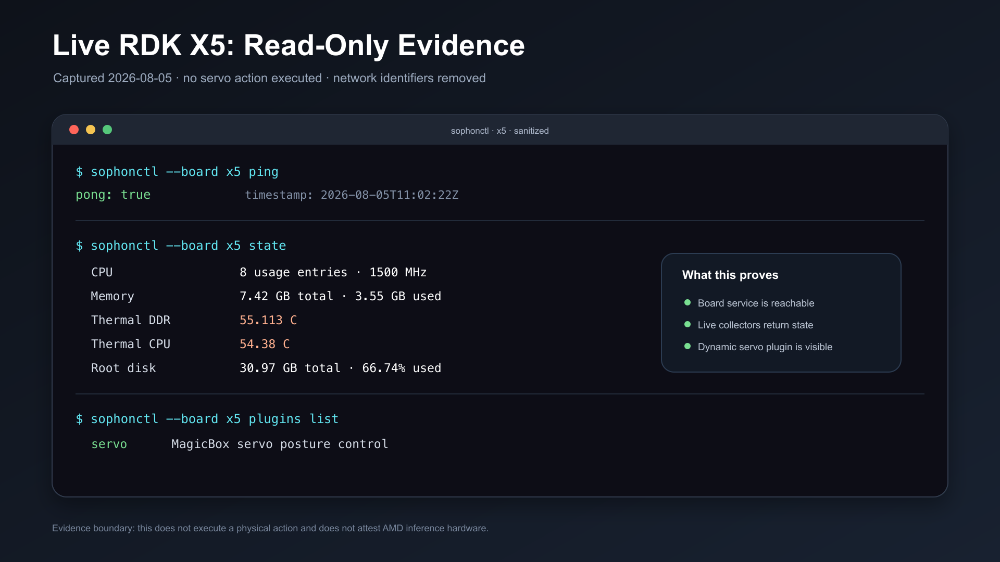

# RDK Agent — AMD AI DevMaster Track 2

[English](README.md) | [简体中文](README.zh-CN.md)

> From natural-language requirements to governed robot capabilities on RDK X5.

RDK Agent is a privately deployed, multi-agent platform for developing and operating robot capabilities on an RDK X5. State and device control remain local; model inference can use a participant-controlled private endpoint. A developer describes a robot behavior in natural language, and specialized agents transform it into a tested, validated, deployable, and reusable capability.


> The cover is a project-created conceptual illustration, not a photograph of the submitted hardware.

This English README is the authoritative competition-facing description for the AMD AI DevMaster Track 2 submission. The [Chinese README](README.zh-CN.md) is a localized reference for team review, presentation, and demo preparation; it does not replace the English competition copy.

## 0. Track 2 submission at a glance

| Field | Value |
| --- | --- |
| Track | Track 2 - Development and Local Deployment of Private AI Agents |
| Application | RDK Agent |
| Team / participant | `<TEAM OR PARTICIPANT NAME>` |
| Source repository | <https://github.com/cowhorseming/rdk-sophon> |
| Demo video | [Bilibili primary](https://www.bilibili.com/video/BV1t3up6iEhy/) · [Baidu Cloud MP4 backup](https://dagent-platform.bj.bcebos.com/amd-hackathon/amd-hackathon-2026-07.mp4?authorization=bce-auth-v1/ALTAKYR0nFJFHMGlFjuontyVVP/2026-08-06T12%3A43%3A01Z/-1/host/1a12970cc4c9439caa28199256b028f90e82ba41ac92c68fb921b271be0b0acd) |
| PR title | `Track 2, <TEAM OR PARTICIPANT NAME>, RDK Agent` |
| Official deadline | 2026-08-06 23:59 Beijing/Singapore time (UTC+8) |

Current delivery status:

| Requirement | Status | Evidence or attachment |
| --- | --- | --- |
| Project specification | Complete | This README and the [12-page PDF](submission/en/deliverables/RDK_Agent_Project_Specification.pdf) |
| Complete source and README | Complete | This monorepo; subsystem details are in the [`rdk-agent` README](rdk-agent/README.md) and [`rdk-sophon` README](rdk-sophon/README.md) |
| Demo video, 3-5 minutes | Complete; 3:07.2, 1080p, H.264/AAC; two public links verified | [Bilibili primary](https://www.bilibili.com/video/BV1t3up6iEhy/) · [Baidu Cloud backup](https://dagent-platform.bj.bcebos.com/amd-hackathon/amd-hackathon-2026-07.mp4?authorization=bce-auth-v1/ALTAKYR0nFJFHMGlFjuontyVVP/2026-08-06T12%3A43%3A01Z/-1/host/1a12970cc4c9439caa28199256b028f90e82ba41ac92c68fb921b271be0b0acd) |
| Supplementary presentation | Complete | [12-slide PowerPoint deck](submission/en/deliverables/RDK_Agent_Track2_Pitch_Deck.pptx) |
| AMD Radeon/ROCm deployment and optimization plan | Complete | Configuration, controlled experiments, metrics, and benchmark procedure are included in Sections 8–9 |
| AMD server and performance proof | Complete for the trained model; **pending for the 80B agent backend** | Model side: [model track index](submission/en/MODEL_TRACK.md) — gfx1100, ROCm 7.2.1, adapter hash, and baseline-versus-optimized A/B, all recomputable offline. Agent backend side: vLLM host, model revision, and precision still to be attached |
| Verification evidence | Captured on 2026-08-05 | [Raw verification record](submission/en/evidence/verification-2026-08-05.md) |

Before final submission, the participant must provide:

1. The exact registered team name or participant name.
2. Redacted, reproducible Radeon GPU, ROCm, vLLM, model revision, precision/quantization, and benchmark evidence from the participant-controlled instance.
3. A final review of the worktree and explicit approval before commit and publication.

## 1. Executive summary

RDK Agent is a private multi-agent development and operation platform for RDK robots. A developer describes a behavior in natural language. Specialized agents then design tests, implement only the bounded action entry point, verify executable evidence, construct a deterministic release, deploy it to the board, install it as a reusable Skill, and perform controlled CLI and natural-language acceptance checks. The submitted action-package path currently targets parameterless `rdk-servo-action/v1` actions for the MagicBox servo runtime.

The project addresses a concrete robotics problem: even a small behavior crosses natural-language intent, Python hardware logic, tests, command-line integration, remote deployment, Skill metadata, and physical verification. Manual handoffs are difficult to reproduce, while a general-purpose coding agent needs stronger controls before it can interact with real hardware.

RDK Agent separates model-driven reasoning from deterministic delivery and device execution. Agents work within tool, Skill, filesystem, timeout, and sandbox boundaries. Deterministic scripts control scaffolding, validation, release structure, hashes, and atomic deployment. The RDK X5 exposes a stable control and telemetry contract through `sophonctl` and `probe-daemon`.

The repository contains two independently buildable and deployable systems:

| Directory | Stack | Responsibility |
| --- | --- | --- |
| `rdk-agent/` | TypeScript, Pi SDK | TUI/headless application, intent routing, multi-agent TDD, scoped tools, Skill selection and installation, deterministic delivery adapters, deployment, and human-in-the-loop recovery. |
| `rdk-sophon/` | Rust | RDK X5 `probe-daemon`, `sophonctl`, hardware-state collection, JSON-RPC, telemetry, alerts, command policy and audit, transports, and dynamic plugins. |

The two subprojects share no Cargo or npm workspace and no internal code dependency. Their integration contract is the `sophonctl` CLI and the board-side JSON-RPC protocol, so either directory can later move to an independent repository without changing the other system's architecture.

## 2. Why “Sophon”? - The naming story

The board-side subsystem `rdk-sophon` takes its name from the sophon (智子) in *The Three-Body Problem*. In the novel, an extraordinarily advanced messenger is sent across space to Earth, where it can observe human activity and sustain communication with its origin.

This project deliberately reinterprets that science-fiction idea as transparent, owner-controlled engineering:

| Literary metaphor | `rdk-sophon` implementation |
| --- | --- |
| A messenger is sent to a distant world | `probe-daemon` is deployed to the RDK X5 board. |
| It observes local conditions | Collectors read temperature, CPU, memory, disk, network, and BPU state. |
| It reports across a long communication link | Telemetry and JSON-RPC carry board state to development-host clients. |
| It mediates communication with the distant system | `sophonctl` connects `rdk-agent` to board-side plugins and capabilities. |
| It can influence events remotely | Governed commands can invoke an approved robot capability. |

The ethical and operational direction is intentionally different from covert fictional surveillance: `rdk-sophon` is installed by the device owner, exposes explicit interfaces, keeps an audit trail, applies command policy, and restricts agent permissions.


> This is a project-created AI-generated conceptual illustration. No official artwork or assets from the novel or its adaptations are used. The name is a literary allusion used only to explain an internal code name. This independent project is not endorsed by or affiliated with the work's author, publishers, rights holders, or screen adaptations.

## 3. Target users and application scenarios

### 3.1 Robot application developers

A developer can request a new self-contained robot action without manually coordinating test files, control code, plugin registration, Skill documentation, deployment, and acceptance.

Example:

```text
Developed a feature that waves the left hand.
```

The system preserves the original request throughout the workflow. If generated metadata, paths, or hardware calls reverse the requested side, a deterministic guard rejects the change before it is written.

### 3.2 Robotics educators and prototype teams

The visible Test -> Code -> Verify loop makes agentic robot development inspectable. Offline tests use fakes and mocks; the model does not need direct GPIO access to develop a capability.

### 3.3 RDK X5 operators

The same platform provides read-only inspection for temperature, CPU, memory, disk, network, BPU, and dynamic plugins. It distinguishes a successful command path from human confirmation that physical motion was correct.

### 3.4 Reusable private robot capabilities

Validated capabilities become local Skills. Robot Application Mode can select an installed Skill from natural language and execute one mapped action without reopening the development workflow.

## 4. System architecture and repository boundaries



```text
Development host                                           RDK X5

User -> RDK Agent TUI / headless runner
          |-- intent gate
          |-- Action Package TDD: test -> code -> verify
          |-- deterministic build and deployment tools
          |-- offline Podman test sandbox
          `-- generated Skills
                    |
                 sophonctl -------- TCP 7777 --------> probe-daemon
                                                        |-- hardware collectors
                                                        |-- telemetry and alerts
                                                        `-- servo plugin -> action packages

RDK Agent -> private OpenAI-compatible endpoint -> vLLM -> ROCm -> AMD Radeon GPU
```

| Component | Responsibility |
| --- | --- |
| `rdk-agent` | TypeScript TUI/headless application, intent routing, multi-agent orchestration, scoped tools, Skill selection, deterministic delivery adapters, and human-in-the-loop handling. |
| `sophonctl` | Stable development-host command contract for board state, plugins, and actions. |
| `probe-daemon` | Rust service on RDK X5 for RPC dispatch, state collection, telemetry, alerting, command policy, audit, and dynamic plugins. |
| Servo plugin and action packages | Board-side Python capability runtime with local metadata and independently removable action packages. |
| Private model server | OpenAI-compatible inference endpoint on a participant-controlled AMD Radeon Cloud instance with ROCm; selected through Pi configuration rather than application code. |

`rdk-agent` does not link against the Rust crates. It invokes the installed `sophonctl` client, which communicates with `probe-daemon` over TCP port 7777. Model inference proposes bounded work; deterministic tools and the board contract govern what is written or executed. Model selection is isolated behind the Pi SDK session adapter, so a private OpenAI-compatible server can replace another provider without changing workflow or device code.

## 5. Two operating modes and five-node workflow



### 5.1 Robot Development Mode and Intent Gate

Robot Development Mode sends supported requests through the intent gate and multi-agent TDD loop, then builds a release, deploys it to the RDK X5, installs the generated Skill, and performs controlled acceptance checks.

Exact greetings and acknowledgements are answered deterministically. Other development input is classified in a short model session with no tools, Skills, project context, or filesystem writes. Only a high-confidence request inside the supported action-package scope starts development. In normal use, enter the request directly; `/develop` is only an explicit human override when intent classification must be bypassed.

### 5.2 Action Package TDD

The bounded TDD loop has three specialized roles:

1. **Action Test Design Agent** creates or revises behavior tests and action metadata.
2. **Action Coding Agent** implements only the action entry point.
3. **Action Verification Agent** independently runs contract and behavior checks without write access.

Failed verification restarts the full Test -> Code -> Verify loop. After three unsuccessful iterations, the workflow pauses for human guidance rather than silently continuing.

### 5.3 Deterministic Five-Node Delivery

After verification, four ordered delivery stages run:

1. **Board Release Deployment Agent** calls deterministic build tooling and atomically publishes the release.
2. **Skill Installation Agent** installs the generated runtime Skill on the development host.
3. **CLI Hardware Acceptance Agent** executes the new capability once through `sophonctl`.
4. **Natural-Language Skill Acceptance Agent** selects the installed Skill using the original request and executes the same capability once.

The five visible development nodes are therefore:

1. Action Package TDD: Test Agent -> Coding Agent -> Verification Agent.
2. Board Release Deployment.
3. Development-host Skill Installation.
4. CLI Hardware Acceptance.
5. Natural-Language Skill Acceptance.

### 5.4 Robot Application Mode

Application Mode has a separate single-agent path. Capability questions remain read-only. An imperative request authorizes one mapped action. The tool layer enforces this distinction even if model text is incorrect.

## 6. Core capabilities and Track 2 fit

### 6.1 Tool Calling

Each agent receives only the tools needed for its current stage. Custom tools provide bounded operations such as scaffolding, validation, building, and deployment instead of unrestricted script execution.

### 6.2 Multi-Step Planning and Task Execution

The domain workflow enforces ordered handoffs from intent routing through TDD, release, deployment, Skill installation, and two acceptance paths. A later stage starts only after its prerequisites succeed.

### 6.3 Permission and Privacy Controls

Each agent has tool, Skill, write-path, timeout, and sandbox boundaries. Development tests run in a network-disabled Podman container with a read-only workspace and resource limits; credentials and host home directories are not mounted. Deterministic left/right consistency checks, executable-evidence gates, and atomic deployment add further controls before mutation.

### 6.4 Human-in-the-Loop Recovery

The workflow pauses for human input when it encounters ambiguity, an invalid structured result, a model or tool error, or an exhausted revision budget. `/abort` stops a blocked run.

### 6.5 Local Device Telemetry and Dynamic Execution

`probe-daemon` provides on-demand snapshots and telemetry covering temperature, CPU, memory, disk, network, and BPU state. Dynamic plugin commands use exact argument vectors rather than `sh -c`. Robot action packages are discovered from a local registry and can be removed without recompiling the Rust CLI.

### 6.6 Track 2 Capability Matrix

The Track 2 rules list five agent capabilities and require at least two. This project claims only capabilities implemented in the repository:

| Track capability | Status | Evidence boundary |
| --- | --- | --- |
| Local RAG | Not implemented | Not claimed. |
| Tool calling | Implemented | Scoped read/bash/write/edit plus deterministic action-package and deployment tools. |
| Multi-step planning | Implemented | Ordered domain workflow with bounded TDD revision. |
| Local multi-turn memory | Partial | In-memory sessions and human follow-up exist; persistent cross-run memory is not implemented and is not counted. |
| Permission/privacy mechanism | Implemented at the agent/tool layer | Allowlists, offline sandbox, read-only mounts, evidence gates, and explicit action/query separation. Transport authentication and normal-path per-action approval remain roadmap items. |

## 7. Safety and reliability design

### 7.1 Safety below the prompt layer

Prompt instructions are not the only control. File tools validate paths, Bash rejects file mutation and unsafe command forms, action-package tooling validates structure and semantics, and hardware actions are unavailable to development agents.

### 7.2 Direction-consistency guard

When the original request explicitly identifies left, right, or both sides, the action ID, metadata, intent examples, directory, and Python bridge calls must agree. Conflicts fail with stable code `ACTION-DIRECTION-001` before mutation.

### 7.3 Executable evidence gate

A textual `passed` result is insufficient. The runner records whether the Verification Agent actually executed Bash and whether the final check succeeded. Missing or failed evidence changes the result to revision.

### 7.4 Deterministic contract validation

The action-package format rejects imports, dynamic execution, private controller access, runtime parameters, asynchronous entry points, and coupling to test-spy fields. Release structure and metadata are generated by scripts rather than free-form model output.

### 7.5 Atomic deployment

Deployment uploads to staging, validates files and hashes, takes a backup, replaces the target, and restores the backup when a post-swap step fails.

### 7.6 Honest physical acceptance

Automated checks prove the command path and software contract. They do not prove that physical motion looked correct. Final motion remains a human-observed acceptance boundary.

## 8. Model and private AMD deployment

The Pi SDK is the only layer that resolves a model provider. Domain and application code are model-independent. Each stage creates an isolated in-memory session and reports the selected provider and model at runtime.

The Track 2 target is a participant-controlled, dedicated vLLM service on Radeon Cloud. The model process is intended to run on that AMD Radeon GPU instance with ROCm; a shared public model API must not be the only core inference path.

```text
RDK Agent -> OpenAI-compatible private endpoint -> vLLM -> ROCm -> AMD Radeon GPU
     |
     `-> sophonctl -> RDK X5 -> probe-daemon -> servo capability
```

The current private client configuration selects:

| Field | Value |
| --- | --- |
| Pi provider | `amd` |
| Model | `Qwen3-Next-80B-A3B-Instruct` |
| API shape | OpenAI-compatible Chat Completions |
| Declared context window | 131,072 tokens |
| Declared maximum output | 8,192 tokens |

The real endpoint and API key are intentionally excluded. The public [sanitized Pi model configuration](submission/en/config/pi-models.amd-rocm.example.json) reads the key from an environment variable. This client configuration proves model routing only; it does not prove GPU type, ROCm version, serving backend, model revision, precision, or quantization.

## 9. AMD Radeon and ROCm optimization and evidence

### 9.1 Compliance Target

The Track 2 core inference path is intended to use a participant-controlled, dedicated vLLM service on Radeon Cloud. The model process runs on an AMD Radeon GPU through ROCm, and `rdk-agent` reaches it through an OpenAI-compatible service boundary. A shared public model API must not be the only core inference path.

### 9.2 Implemented Software-Level Inference Controls

The application already reduces unnecessary model work:

- Exact greeting and acknowledgement traffic bypasses inference.
- Intent classification uses a short, tool-free, Skill-free, context-free session.
- Each agent has one focused role rather than one expanding conversation.
- Only allowlisted Skills are loaded, and explicit selection evidence is required.
- Cross-stage text handoffs are bounded to the last 6,000 characters while files remain the durable source of truth.
- Deterministic scripts handle scaffolding, validation, packaging, hashes, and deployment without extra model calls.
- Independent in-memory sessions prevent unrelated history from accumulating across stages.

These controls reduce tokens, context growth, and variability regardless of accelerator. They are not substitutes for measured GPU optimization.

### 9.3 Server Evidence Required Before Final Submission

Capture and redact the following evidence from the participant-controlled Radeon instance:

1. GPU product and driver information from `rocm-smi`.
2. ROCm/HIP versions from `rocminfo` and PyTorch.
3. The vLLM version and exact launch command.
4. The model repository, revision, and served model name.
5. Precision or quantization configuration.
6. The local `/v1/models` response.
7. A credential-free screenshot proving control of the Radeon Cloud instance.

### 9.4 Controlled Optimization Matrix

Hold prompts, output limits, software revision, and correctness criteria constant. Change one variable at a time.

| Experiment | Baseline | Candidate | Required evidence |
| --- | --- | --- | --- |
| Precision/quantization | Server default | Hardware-supported lower precision or quantized model | Exact launch flags, VRAM, correctness, TTFT, tokens/s |
| Context limit | Maximum supported | Bounded to measured workflow needs | Input tokens, truncation checks, latency, VRAM |
| Warm model | Cold process | Warm process with documented warm-up | Cold/warm samples, p50/p95 |
| Memory utilization | Server default | Tuned vLLM utilization | OOM-free repeated runs, peak VRAM |
| Concurrency | One request | Measured low concurrency | Per-request latency and throughput |
| Prompt workload | Full generic context | Scoped agent plus selected Skill | Token counts, stage correctness, end-to-end time |

Required metrics:

- Client time to first token (TTFT), p50 and p95.
- Decode output tokens per second.
- Total request latency.
- End-to-end workflow time.
- Peak VRAM and GPU utilization.
- Power or energy only where the target exposes reliable counters.
- Correct-response and acceptance rate under the same prompts.

The included [OpenAI-compatible benchmark script](submission/en/scripts/benchmark-openai-compatible.mjs) issues repeatable fixed-prompt streaming requests and reports p50/p95 client TTFT, total latency, decode throughput when token usage is returned, and response correctness. It never writes the API key to its report.

```sh
node submission/en/scripts/benchmark-openai-compatible.mjs \
  --provider amd \
  --runs 10 \
  --output submission/en/evidence/amd-endpoint-benchmark.json
```

The report contains the endpoint host for traceability but no scheme, path, or key. Remove or hash the host as well if it reveals private infrastructure. Run the same prompt set against baseline and tuned configurations, report p50 and p95 rather than only the fastest request, and interpret client results alongside server utilization and profiler evidence.

### 9.5 Current Evidence Status

| Item | Status |
| --- | --- |
| Client provider/model selection | Verified locally; sanitized in this repository |
| AMD Radeon GPU model | Evidence pending |
| ROCm/HIP version | Evidence pending |
| Dedicated vLLM server version and configuration | Evidence pending |
| Model repository/revision and precision/quantization | Evidence pending |
| Local `/v1/models` response | Evidence pending |
| Baseline and tuned TTFT | Evidence pending |
| Baseline and tuned decode throughput | Evidence pending |
| Peak VRAM/utilization | Evidence pending |
| End-to-end agent workflow latency | Evidence pending |

This project does not fabricate AMD performance data. No unmeasured value should be changed from `Evidence pending` to a number. Before judging, attach redacted server output, the exact vLLM launch command, model revision, precision or quantization setting, container digest if used, warm-up policy, and a screenshot of the participant-controlled Radeon Cloud instance without credentials.

## 10. Installation, deployment, and reproduction

The following path separates development-host verification, read-only RDK X5 checks, full deployment, private AMD inference, and physical-action acceptance. Evaluators can run the local checks and read-only board checks without moving the robot.

### 10.1 Repository layout

```text
rdk-sophon/
├── rdk-agent/       TypeScript multi-agent TUI and delivery tooling
├── rdk-sophon/      Rust device platform and sophonctl
└── submission/      Competition attachments, evidence, configuration, and scripts
```

### 10.2 Prerequisites

Development host:

- macOS or Linux.
- Node.js 22.19 or newer and npm.
- Rust toolchain with Cargo.
- Podman for Robot Development Mode; the installer prepares the fixed `docker.io/library/python:3.12-slim` image.
- SSH access to the RDK X5 for deployment.

RDK X5:

- Ubuntu on aarch64; the deployment flow has been exercised against Ubuntu 22.04.
- `systemd` and root access for installation.
- SSH host alias `x5-root`, or a replacement supplied to the deployment script.
- Python 3 and the device permissions required by the MagicBox runtime and `Hobot.GPIO`.

Private AMD inference:

- An AMD Radeon GPU environment with a compatible ROCm stack.
- A participant-controlled, dedicated OpenAI-compatible vLLM service.
- The sanitized Pi model configuration linked above.

### 10.3 One-Click Installation

Clone the repository, then run the integrated installer from the repository root:

```sh
git clone https://github.com/cowhorseming/rdk-sophon.git
cd rdk-sophon

export RDK_BOARD_IP=192.0.2.10 # Documentation-only address; replace with the board IP.
./rdk-agent/deploy/install-rdk-agent-stack.sh \
  --ssh-host x5-root \
  --board-address "$RDK_BOARD_IP:7777"
```

This single entry point installs the RDK X5 services and servo runtime, builds and installs the development-host `sophonctl`, prepares the Podman sandbox, and installs the `rdk-agent` TUI. It invokes npm and Cargo internally; evaluators do not need to run separate dependency-install commands. It finishes with read-only integration checks and does not move the robot.

### 10.4 Optional Source-Level Verification

The following commands are for contributors who want to verify the source tree; they are not installation steps.

TypeScript:

```sh
cd rdk-agent
npm run check
npm test
```

Expected evidence for the submitted snapshot: the TypeScript check succeeds and 134 tests pass.

Rust, starting again from the repository root:

```sh
cd rdk-sophon
cargo test --workspace
cargo clippy --workspace -- -D warnings
cargo build --release --workspace
```

Expected evidence for the submitted snapshot: 62 tests pass, Clippy succeeds with warnings denied, and the release workspace builds. Some end-to-end tests bind local TCP or Unix sockets and must run in an environment that permits loopback socket binding.

For day-to-day development, the aggregate Rust script can also be run from the Rust subproject:

```sh
cd rdk-sophon
./scripts/full_test.sh
```

The repository's `scripts/full_test.sh` pipeline was not recorded as a single run for this snapshot. Its constituent check, Clippy, test, and release-build stages were run separately and passed. A separate `cargo fmt --all -- --check` reported existing formatting differences; formatting is not part of `full_test.sh`.

### 10.5 Inspect the TUI without moving hardware

After one-click installation, start the installed application:

```sh
rdk-agent
```

The TUI starts in Robot Application Mode. Press `Shift+Tab` to cycle between Robot Application Mode and Robot Development Mode, and confirm the selected mode in the status bar. For a safe UI inspection, do not submit a robot action; use only read-only inspection commands:

```text
/modes
/skills
/workspace
```

Do not submit an imperative robot request during a safe UI inspection. The default mode is Robot Application Mode, where an imperative request authorizes one mapped action.

### 10.6 Verify the RDK X5 Client

The one-click installer writes the `x5` board address supplied through `--board-address` to `~/.rdk-sophon/config.toml`. Verify the installed client with read-only checks:

```sh
sophonctl --board x5 ping
sophonctl --board x5 state
sophonctl --board x5 plugins list
```

The submitted evidence captured `pong: true`, a live state snapshot, and the `servo` plugin on 2026-08-05.

### 10.7 Advanced Deployment Variants

The integrated deployment entry point lives under `rdk-agent`, but it orchestrates deliverables owned by both subprojects:

- `rdk-sophon` on the board: aarch64 binaries such as `probe-daemon`, configuration, and systemd services.
- `rdk-agent` on the board: MagicBox servo application scripts, standalone action packages with a local registry, and the plugin manifest.
- `rdk-sophon` on the development host: the native-architecture `sophonctl` client.
- `rdk-agent` on the development host: the TUI, Agent/Skill configuration, and development sandbox.

The default command in Section 10.3 installs the complete stack. For an existing environment, the same installer can update only the board or only the development host:

```sh
export RDK_BOARD_IP=192.0.2.10 # Documentation-only address; replace with the board IP.

# Board services and servo runtime only
./rdk-agent/deploy/install-rdk-agent-stack.sh \
  --board-only \
  --ssh-host x5-root \
  --board-address "$RDK_BOARD_IP:7777"

# Development host only
./rdk-agent/deploy/install-rdk-agent-stack.sh \
  --development-only \
  --board-address "$RDK_BOARD_IP:7777"
```

For deeper installation paths and parameters, see the [`rdk-agent` subsystem documentation](rdk-agent/README.md) and [`rdk-sophon` subsystem documentation](rdk-sophon/README.md).

### 10.8 Configure private AMD Radeon inference

Use a participant-controlled Radeon Cloud instance with a compatible ROCm stack and a dedicated OpenAI-compatible vLLM service. The service must listen on `0.0.0.0:8000` when using the competition's Model API routing. Example service shape:

```sh
export MODEL_PATH_OR_ID=/path/to/model-or-hub-id
vllm serve "$MODEL_PATH_OR_ID" \
  --served-model-name Qwen3-Next-80B-A3B-Instruct \
  --host 0.0.0.0 \
  --port 8000
```

Copy the sanitized client configuration from the repository root:

```sh
mkdir -p ~/.pi/agent
cp submission/en/config/pi-models.amd-rocm.example.json ~/.pi/agent/models.json
```

Set the real private base URL only in the copied file. Keep the API key outside the repository:

```sh
read -r -s RDK_AMD_MODEL_API_KEY
export RDK_AMD_MODEL_API_KEY
```

Select the model in `~/.pi/agent/settings.json`:

```json
{
  "defaultProvider": "amd",
  "defaultModel": "Qwen3-Next-80B-A3B-Instruct"
}
```

Do not publish the live endpoint or key. Redact secrets and user-specific tunnel names from screenshots and logs.

### 10.9 Capture server-side AMD evidence

Run equivalent commands inside the participant-controlled Radeon instance and save redacted output:

```sh
rocminfo
rocm-smi --showproductname --showdriverversion --showmeminfo vram
python3 -c 'import torch; print(torch.__version__); print(torch.version.hip); print(torch.cuda.get_device_name(0))'
python3 -c 'import vllm; print(vllm.__version__)'
curl http://127.0.0.1:8000/v1/models
```

Also record the exact vLLM launch command, model repository and revision, served model name, precision or quantization setting, container digest if used, and warm-up policy.

### 10.10 Run Robot Development Mode

Start the installed TUI:

```sh
rdk-agent
```

Press `Shift+Tab` until the status bar shows Robot Development Mode, then enter the development request directly as normal conversation:

```text
Create a new action that waves the left side once.
```

The intent gate recognizes a supported, high-confidence development request and starts the five-node workflow automatically. `/develop <request>` exists only as a manual override to bypass intent classification; it is not required in this normal path. The final two acceptance stages may move real hardware. Keep the robot clear of people and obstacles and be prepared to abort.

### 10.11 Run Robot Application Mode

After the Skill is installed, press `Shift+Tab` until the status bar shows Robot Application Mode, then enter the action request directly:

```text
Wave the left side once.
```

An imperative request authorizes one mapped action. A successful command path does not by itself prove that physical motion was correct; record a human observation separately.

### 10.12 Expected outputs

- Test reports for the TypeScript and Rust workspaces.
- TUI stage progress and tool/Skill events.
- An action-package release with deterministic metadata and hashes.
- A board deployment receipt and installed Skill.
- `sophonctl` state and plugin output.
- One CLI and one natural-language acceptance invocation.
- Redacted Radeon/ROCm/vLLM environment evidence and benchmark JSON.

### 10.13 Troubleshooting boundaries

- If Rust end-to-end tests fail with `Operation not permitted` while binding `127.0.0.1`, run them outside a restricted sandbox.
- If HTTP or WebSocket adapters are used, explicitly pass `/run/probe-daemon/probe.sock` until their source defaults are aligned with daemon configuration.
- If a real servo action fails, verify GPIO permissions for the unprivileged `probe` service user.
- If the model is unavailable, verify provider/model selection, the private endpoint, and the API-key environment variable without printing the key.

## 11. Verified evidence and boundary

Evidence was captured on 2026-08-05. The [raw verification record](submission/en/evidence/verification-2026-08-05.md) contains the sanitized command transcript.

| Area | Result |
| --- | --- |
| TypeScript static check | Passed |
| `rdk-agent` automated tests | 134 passed, 0 failed |
| `rdk-sophon` automated tests | 62 passed, 0 failed |
| Rust Clippy with warnings denied | Passed |
| Rust release workspace build | Passed |
| Live RDK X5 ping | `pong: true` |
| Live RDK X5 state | 8 CPU usage entries, 1500 MHz core frequency; 7,424,344,064 bytes memory total and 3,550,343,168 bytes used |
| RDK X5 temperature | DDR 55.113 °C; CPU 54.38 °C |
| Dynamic plugin discovery | `servo` plugin found |
| Client model routing | Provider `amd`, model `Qwen3-Next-80B-A3B-Instruct`, OpenAI-compatible Chat Completions |





Evidence boundaries:

- `cargo fmt --all -- --check` reported existing formatting differences, so this submission does not describe the Rust formatting check as passing.
- This snapshot does not describe the complete `scripts/full_test.sh` pipeline as one complete run; its constituent stages were run and verified separately.
- The client model configuration proves model selection only; it does not prove the **80B agent backend** server-side GPU, ROCm, vLLM, model revision, or quantization.
- Radeon/ROCm/vLLM/precision evidence and performance benchmarks for the **80B agent backend** remain to be captured.
- For the **team's own trained model** (`Qwen3-32B-Agentic-SFT-r1-v3`), those facts are attested and reproducible: GPU `gfx1100`, ROCm 7.2.1, torch 2.9.1+rocm7.2.0, adapter SHA-256 `4dcee691…f20bf`, NF4 4-bit quantization, and a baseline-versus-optimized A/B measured on that host (user-visible TTFT p50 17.41 s → 8.26 s, peak VRAM 27.99 → 28.06 GB, 88/88 outputs byte-identical). See the [model track index](submission/en/MODEL_TRACK.md); `results.json` is generated by the benchmark on the Radeon host rather than transcribed by hand.
- Automated results prove the software contract and command path only; physical motion quality still requires human observation.
- Public evidence omits MAC addresses, credentials, and private infrastructure details.
- Workflow and human-input state are not persisted across process restarts.
- Model runtime configuration is global rather than selected per agent profile.

This submission does not expose credentials, present development-host Mach-O binaries as RDK X5 deliverables, equate command success with proven physical motion quality, or report estimated AMD performance data as measured results.
