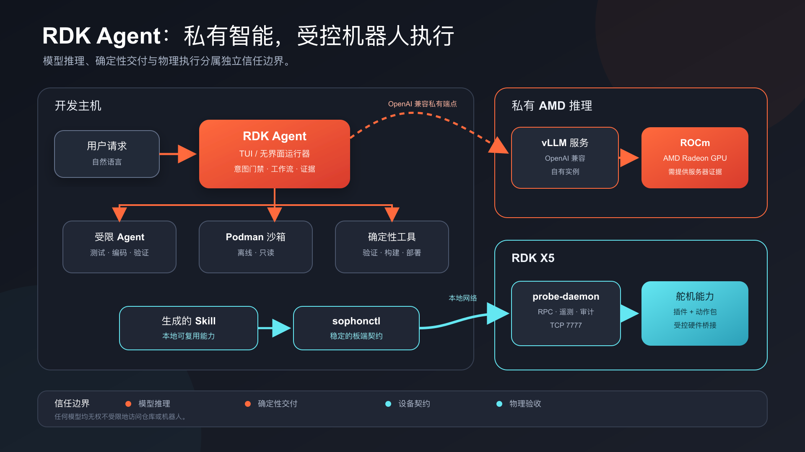
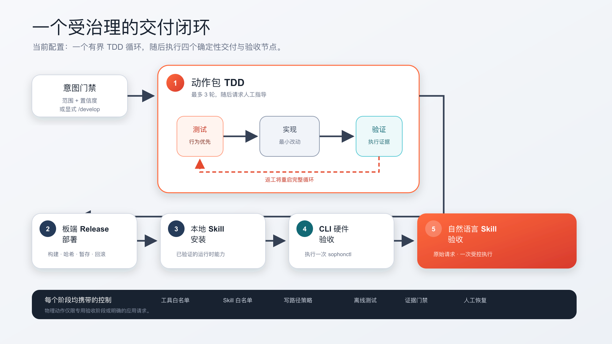
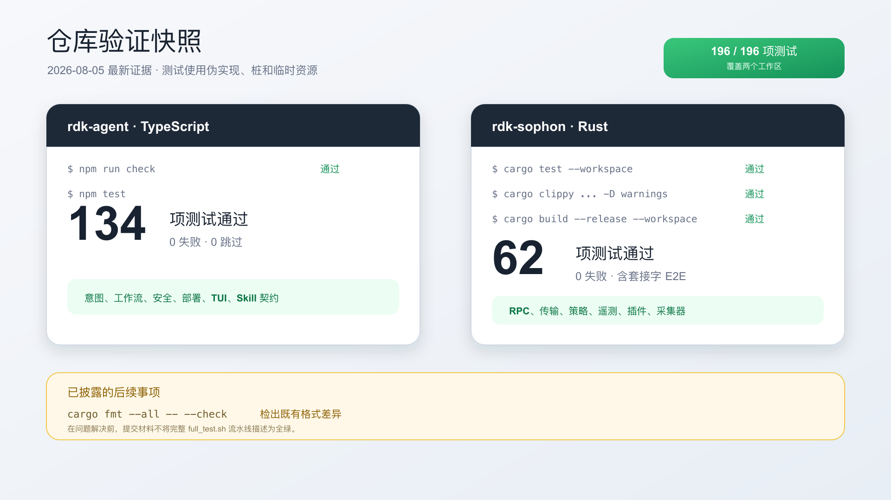
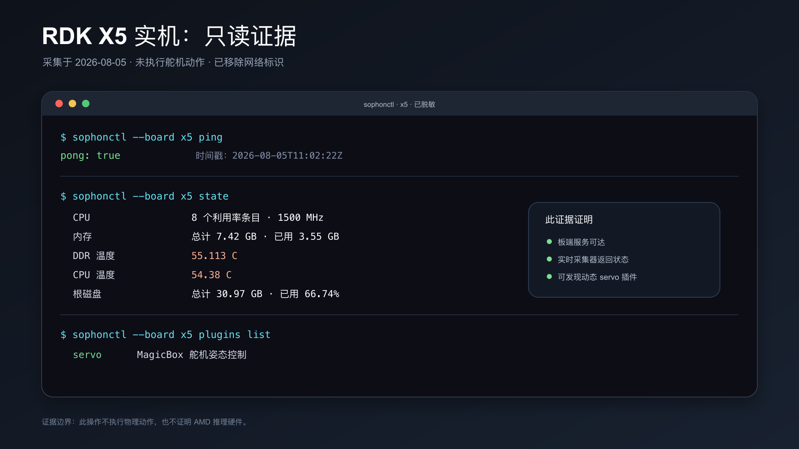

# RDK Agent — AMD AI DevMaster Track 2

> 将自然语言需求转化为 RDK X5 上经过测试、可部署、可复用且受治理的机器人能力。

本文档是项目的完整中文说明，供团队审阅、中文讲解和演示准备使用。面向比赛评审与 Pull Request 的正式版本以仓库根目录的[英文 README](README.md)为准；如中英文表述存在差异，应以英文版本为准。

| 项目 | 内容 |
| --- | --- |
| 参赛赛道 | Track 2 — Development and Local Deployment of Private AI Agents（私有 AI 智能体的开发与本地部署） |
| 应用名称 | RDK Agent |
| 源码仓库 | `https://github.com/cowhorseming/rdk-sophon` |
| 团队 / 参赛者 | `<TEAM OR PARTICIPANT NAME>` |
| 演示视频 | [B 站主地址](https://www.bilibili.com/video/BV1t3up6iEhy/) · [百度云 MP4 备用地址](https://dagent-platform.bj.bcebos.com/amd-hackathon/amd-hackathon-2026-07.mp4?authorization=bce-auth-v1/ALTAKYR0nFJFHMGlFjuontyVVP/2026-08-06T12%3A43%3A01Z/-1/host/1a12970cc4c9439caa28199256b028f90e82ba41ac92c68fb921b271be0b0acd) |
| Pull Request 标题 | `Track 2, <TEAM OR PARTICIPANT NAME>, RDK Agent` |


> 封面是由本项目生成的概念插图，不是本次提交硬件实物的照片。真实设备与测试证据见后文。

## 0. Track 2 提交状态速览

| 比赛要求 | 当前状态 | 本文档或附件 |
| --- | --- | --- |
| 项目说明书 | 已完成 | 本文档与[中文项目说明书 PDF](submission/zh/deliverables/RDK_Agent_Project_Specification.pdf) |
| 完整源代码与 README | 已完成 | 本 monorepo；两个子系统的深层说明见 [`rdk-agent`](rdk-agent/README.md) 与 [`rdk-sophon`](rdk-sophon/README.md) 文档 |
| 3–5 分钟演示视频 | 已完成；两个公开地址均已验证 | [B 站主地址](https://www.bilibili.com/video/BV1t3up6iEhy/) · [百度云备用地址](https://dagent-platform.bj.bcebos.com/amd-hackathon/amd-hackathon-2026-07.mp4?authorization=bce-auth-v1/ALTAKYR0nFJFHMGlFjuontyVVP/2026-08-06T12%3A43%3A01Z/-1/host/1a12970cc4c9439caa28199256b028f90e82ba41ac92c68fb921b271be0b0acd) |
| 补充 PPT / 海报 | 已完成 | [中文 12 张幻灯片路演 PPTX](submission/zh/deliverables/RDK_Agent_Track2_Pitch_Deck.pptx) |
| AMD Radeon/ROCm 部署与优化方案 | 已完成 | 客户端配置、受控实验、指标与基准方法见本文第 8–9 节 |
| AMD 服务器与性能证明 | 自训练模型侧已完成；**80B Agent 后端侧待补充** | 模型侧：[模型侧索引](submission/zh/MODEL_TRACK.md) —— gfx1100、ROCm 7.2.1、adapter 哈希与基线/优化 A/B，均可离线重算。Agent 后端侧：vLLM 主机、模型 revision 与精度仍待补充 |
| 验证证据 | 已于 2026-08-05 采集 | 本文第 11 节与[原始脱敏日志](submission/zh/evidence/verification-2026-08-05.md) |
| 正式比赛文案 | 英文版为准 | 仓库根目录[英文 README](README.md) |

正式提交前，材料所有者仍需补齐：准确的团队或参赛者名称、脱敏且可复现的 AMD 服务器及性能证据，以及对最终 commit / 发布的明确批准。当前材料记录的截止时间为 **2026-08-06 23:59（UTC+8，北京/新加坡时间）**。

## 1. 执行摘要

RDK Agent 是一个私有化部署的多智能体平台，用于在 RDK X5 上开发和运行机器人能力。设备状态与控制链路保留在本地，模型推理可以使用由参赛者控制的私有端点。开发者只需用自然语言描述机器人行为，系统便会依次完成测试设计、实现、可执行验证、发布构建、开发板部署、Skill 安装和受控硬件验收，将需求转化为可独立打包、部署和移除的能力。

本次提交当前聚焦 MagicBox 舵机运行时，并仅支持不带运行时参数的 `rdk-servo-action/v1` 动作。它解决的是一个具体且常见的机器人开发问题：即便一个简单行为，也会横跨自然语言意图、Python 硬件逻辑、测试、命令行集成、远程部署、Skill 元数据和实体验收。人工交接难以稳定复现，而通用编码智能体在接触真实硬件前也需要更严格的边界。

RDK Agent 将模型驱动的推理与确定性的交付、设备执行分离。智能体受到工具、Skill、文件系统、超时和沙箱边界的共同约束；确定性脚本负责脚手架、验证、发布结构、哈希和原子部署；RDK X5 通过 `sophonctl` 与 `probe-daemon` 提供稳定的控制和遥测契约。

## 2. 为什么叫“智子”（Sophon）？

开发板侧子系统 `rdk-sophon` 的名称借鉴了《三体》中的“智子”（sophon）概念。小说描绘了一个被派往地球、承担观察和通信任务的先进信使。本项目将这一文学意象重新解释为透明、由设备所有者控制的工程模式：把轻量的 `probe-daemon` 部署到 RDK X5 上，观察设备状态，并通过 `sophonctl` 充当 `rdk-agent` 与硬件能力之间受治理的通信桥梁。

| 文学隐喻 | `rdk-sophon` 中的工程实现 |
| --- | --- |
| 信使被派往遥远世界 | 将 `probe-daemon` 部署到 RDK X5 开发板。 |
| 它观察当地环境 | 采集温度、CPU、内存、磁盘、网络和 BPU 状态。 |
| 它通过长距离链路报告 | 遥测和 JSON-RPC 将开发板状态传递给开发主机。 |
| 它为远端系统协调通信 | `sophonctl` 将 `rdk-agent` 连接到开发板插件和能力。 |
| 它可以远程影响事件 | 受治理的命令可以调用已经批准的机器人能力。 |

与虚构作品中的隐蔽监视不同，`rdk-sophon` 由设备所有者主动安装和控制，提供明确接口，保留审计记录，执行命令策略，并限制智能体权限。


> 本图是由本项目使用 AI 生成的原创概念插图，未使用小说或其改编作品的任何官方美术素材或资产。“智子”这一名称仅作为文学典故，用于解释内部代码名称；本独立项目未获得该作品作者、出版方、权利方或影视改编方的认可，也与其不存在隶属或合作关系。

## 3. 目标用户与应用场景

### 3.1 机器人应用开发者

开发者可以提出一个新的、自包含的机器人动作需求，无需手动协调测试文件、控制代码、插件注册、Skill 文档、部署和验收。

示例：

```text
创建一个让机器人左侧移动一次的新动作。
```

系统会在整个工作流中保留原始需求。如果生成的元数据、路径或硬件调用颠倒了所要求的方向，确定性守卫会在写入前拒绝该变更。

### 3.2 机器人教育工作者与原型团队

可见的“测试 → 编码 → 验证”循环使智能体机器人开发过程可以检查。离线测试使用 fake 和 mock，模型开发能力时不需要直接访问 GPIO。

### 3.3 RDK X5 运维人员

同一平台支持只读查询温度、CPU、内存、磁盘、网络、BPU 和动态插件。系统明确区分“命令链路执行成功”与“由人确认实际动作效果”两类证据。

### 3.4 可复用的私有机器人能力

通过验证的能力会成为本地 Skill。机器人应用模式可以根据自然语言选择已安装的 Skill，并执行一个已经映射的动作，而不必重新进入开发工作流。

## 4. 系统架构与仓库边界



仓库采用 monorepo 组织，但包含两个可独立构建、测试和发布的系统：

| 组件 | 技术栈 | 职责 |
| --- | --- | --- |
| `rdk-agent` | TypeScript | TUI/headless 应用，负责意图路由、多智能体编排、受限工具、Skill 选择、确定性交付适配器和 human-in-the-loop 处理。 |
| `sophonctl` | Rust | 开发主机上的稳定命令契约，用于访问开发板状态、插件和动作。 |
| `probe-daemon` | Rust | 运行在 RDK X5 上的服务，负责 RPC 分发、状态采集、遥测、告警、命令策略、审计和动态插件。 |
| 舵机插件与动作包 | Python / 本地清单 | 开发板侧能力运行时，包含本地元数据和可独立移除的动作包。 |
| 私有模型服务器 | vLLM / ROCm | 目标部署在参赛者控制的 AMD Radeon Cloud 实例上，通过 OpenAI-compatible 边界提供模型推理。 |

仓库主要目录：

```text
rdk-sophon/
├── rdk-agent/       TypeScript 多智能体 TUI 与确定性交付工具
├── rdk-sophon/      Rust 设备平台、probe-daemon 与 sophonctl
└── submission/      Track 2 双语材料、附件、图像与原始证据
```

`rdk-agent` 不链接 `rdk-sophon` 的 Rust crate。它通过开发主机上安装的 `sophonctl` 连接板端 `probe-daemon`，保持两套系统的构建、发布和未来拆仓独立。

```text
开发主机                                             RDK X5

用户 -> RDK Agent TUI / headless runner
          |-- 意图门控
          |-- 动作包 TDD
          |-- 离线 Podman 测试
          |-- 确定性构建与部署
          `-- 生成的 Skills
                    |
                 sophonctl ---- TCP 7777 ----> probe-daemon
                                                   |-- 硬件遥测
                                                   `-- 舵机插件与动作包

RDK Agent -> 私有 OpenAI-compatible vLLM -> ROCm -> AMD Radeon GPU
```

模型运行时与设备运行时同样相互分离：模型推理只提出边界明确的工作，确定性工具和开发板契约负责约束真正写入或执行的内容。比赛结束后，`rdk-agent/` 与 `rdk-sophon/` 都可以整体迁移为独立仓库；它们不共享 Cargo/Node workspace，也不共享内部代码依赖，唯一集成契约是 `sophonctl` CLI 与板端 RPC 接口。

## 5. 两种运行模式与五节点工作流



### 5.1 机器人开发模式与意图门控

机器人开发模式将支持范围内的需求送入意图门控和多智能体 TDD 循环，然后构建发布包、部署到 RDK X5、安装生成的 Skill，并执行受控验收检查。

对于完全匹配的问候和确认语，系统会直接以确定性方式作答。其他开发输入由一个短时模型会话分类；该会话没有工具、Skill、项目上下文和文件系统写权限。只有处于受支持动作包范围内且置信度较高的请求才会启动开发流程。正常使用时直接输入自然语言需求即可；`/develop` 只是在确实需要跳过意图分类时使用的人工覆盖指令。

### 5.2 动作包 TDD

动作包 TDD 使用有界循环：

1. **动作测试设计智能体**创建或修订行为测试与动作元数据。
2. **动作编码智能体**只实现动作入口点。
3. **动作验证智能体**在没有写权限的情况下独立运行契约和行为检查。

验证失败会重新开始完整的“测试 → 编码 → 验证”循环。连续三轮未成功后，工作流会暂停并请求人工指导，而不会静默继续。

### 5.3 确定性五节点交付

验证完成后进入五个有序交付节点：

1. 动作包 TDD：测试智能体 → 编码智能体 → 验证智能体。
2. 开发板发布部署：确定性构建并以原子方式发布 release。
3. 开发主机 Skill 安装：安装生成的运行时 Skill。
4. CLI 硬件验收：通过 `sophonctl` 执行一次新能力。
5. 自然语言 Skill 验收：使用原始需求选择已安装的 Skill，并再次执行同一能力。

### 5.4 机器人应用模式

机器人应用模式采用独立的单智能体路径。对于能力问题，系统保持只读；对于用户明确提出的祈使式请求，系统会授权执行一次已映射动作。即使模型文本出现错误，工具层仍会强制执行查询与动作的边界。

## 6. 核心能力与 Track 2 契合度

### 6.1 工具调用

每个智能体只获得当前阶段所需的工具。自定义工具提供脚手架、验证、构建和部署等有边界的操作，而不是不受限制的脚本执行。

### 6.2 多步骤规划和任务执行

领域工作流强制执行有序交接，覆盖意图路由、TDD、发布、部署、Skill 安装和两条验收路径。只有前置阶段成功后，后续阶段才会启动。

### 6.3 权限和隐私控制

每个智能体都有工具 allowlist、Skill allowlist、写入路径 allowlist、超时和沙箱策略。开发测试在禁用网络的 Podman 容器中运行，使用只读 workspace 和资源限制；测试环境不会挂载凭据或主机 home 目录。

### 6.4 Human-in-the-Loop 恢复

遇到歧义、模型或工具错误、无效结构化结果或耗尽修订预算时，工作流会暂停并请求人工输入。`/abort` 可以终止被阻塞的运行。

### 6.5 本地设备遥测与动态执行

`probe-daemon` 为按需查询和遥测提供单次状态快照。动态插件命令使用精确的参数向量，而不是 `sh -c`。机器人动作包从本地注册表中发现，无需重新构建 Rust CLI 即可移除。

### 6.6 Track 2 能力矩阵

Track 2 规则列出五种智能体能力，并要求至少实现两种。本项目只声明仓库中已经实现的能力：

| 赛道能力 | 状态 | 证据边界 |
| --- | --- | --- |
| Local RAG | 未实现 | 不作声明。 |
| 工具调用 | 已实现 | 受限的 read/bash/write/edit，以及确定性的动作包和部署工具。 |
| 多步骤规划 | 已实现 | 有序领域工作流与有界 TDD 修订。 |
| 本地多轮记忆 | 部分实现 | 已有内存会话和人工跟进；没有跨运行持久化记忆，因此不计入已实现能力。 |
| 权限/隐私机制 | 已在智能体层与工具层实现 | Allowlists、离线沙箱、只读挂载、证据门控，以及动作/查询分离；传输认证和正常路径下的逐动作审批仍在路线图中。 |

## 7. 安全性与可靠性设计

### 7.1 Prompt 层以下的控制

Prompt 不是唯一控制措施。文件工具验证路径，Bash 工具拒绝文件修改和不安全的命令形式，动作包工具验证结构和语义，开发智能体也不能调用硬件动作。

### 7.2 方向一致性守卫

当原始需求明确指出左侧、右侧或双侧时，action ID、元数据、意图示例、目录和 Python bridge 调用必须一致。发生冲突时，系统会在写入前以稳定错误码 `ACTION-DIRECTION-001` 拒绝变更。

### 7.3 可执行证据门控

只有文本形式的 `passed` 结果并不足够。运行器会记录验证智能体是否真正执行 Bash，以及最终检查是否成功。证据缺失或检查失败都会把结果改为“需要修订”。

### 7.4 确定性契约验证

动作包格式拒绝 import、动态执行、访问私有 controller、运行时参数、异步入口点，以及与测试 spy 字段耦合。发布结构和元数据由脚本生成，而不是由模型自由输出。

### 7.5 原子部署

部署流程先上传到 staging 区，验证文件和哈希，创建备份，再替换目标；如果替换后的步骤失败，则恢复备份。

### 7.6 诚实的实体验收边界

自动化检查可以证明命令链路和软件契约，但不会声称实体动作的视觉效果正确。最终动作效果仍需人工观察验收。

## 8. 模型与私有化部署

Pi SDK 是唯一负责解析模型提供方的层，领域代码和应用代码不依赖特定模型。每个阶段都会创建隔离的内存会话，并在运行时报告所选 provider 和 model。

参赛目标部署是在由参赛者控制的 AMD Radeon Cloud 实例上运行专用 vLLM 服务：

```text
RDK Agent -> OpenAI-compatible 私有端点 -> vLLM -> ROCm -> AMD Radeon GPU
     |
     `-> sophonctl -> RDK X5 -> probe-daemon -> 舵机能力
```

当前私有客户端配置：

| 字段 | 值 |
| --- | --- |
| Pi provider | `amd` |
| 模型 | `Qwen3-Next-80B-A3B-Instruct` |
| API 形式 | OpenAI-compatible Chat Completions |
| 声明的上下文窗口 | 131,072 tokens |
| 声明的最大输出 | 8,192 tokens |

真实端点和 API key 被有意排除。仓库仅提供[脱敏后的 Pi 模型配置示例](submission/zh/config/pi-models.amd-rocm.example.json)，并通过环境变量读取密钥。该客户端配置只能证明模型路由，不能证明 GPU 型号、ROCm 版本、服务后端或精度/量化方式。

## 9. AMD Radeon 与 ROCm 优化及证据

### 9.1 合规目标

Track 2 的核心推理链路目标，是在参赛者控制的 Radeon Cloud 上运行专用 vLLM 服务，模型进程在 AMD Radeon GPU 上通过 ROCm 执行，`rdk-agent` 通过 OpenAI-compatible 服务边界访问它。共享公共模型 API 不应成为唯一的核心推理链路。

### 9.2 已实现的软件层推理控制

- 完全匹配的问候和确认消息绕过模型推理。
- 意图分类使用不含工具、Skill 和项目上下文的短时会话。
- 每个智能体只承担一个聚焦角色，避免单一会话无限增长。
- 只加载 allowlist 中的 Skill，并明确记录选择证据。
- 跨阶段文本交接限制在最后 6,000 个字符，文件继续作为事实来源。
- 确定性脚本负责脚手架、验证、打包、哈希和部署，不额外调用模型。
- 相互独立的内存会话避免无关历史在不同阶段累积。

这些控制可以减少 token 消耗、上下文增长和结果波动，但不能替代实际测量的 GPU 优化结果。

### 9.3 最终提交前必须补充的服务器证据

需要从参赛者控制的 Radeon 实例采集并脱敏：

1. `rocm-smi` 输出的 GPU 产品和驱动信息。
2. `rocminfo` 与 PyTorch 输出的 ROCm/HIP 版本。
3. vLLM 版本和确切启动命令。
4. 模型仓库、revision 与 served model name。
5. 精度或量化配置。
6. 本地 `/v1/models` 响应。
7. 能证明参赛者控制该 Radeon Cloud 实例且不包含凭据的截图。

### 9.4 受控优化矩阵

基准实验应保持提示词、输出上限、软件 revision 和正确性标准不变，每次只改变一个变量。

| 实验 | 基线 | 候选配置 | 所需证据 |
| --- | --- | --- | --- |
| 精度/量化 | 服务器默认值 | 硬件支持的较低精度或量化模型 | 启动参数、VRAM、正确性、TTFT、tokens/s |
| 上下文上限 | 支持的最大值 | 限制为工作流实测所需大小 | 输入 token 数、截断检查、延迟、VRAM |
| 模型预热 | 冷进程 | 有记录预热流程的热进程 | 冷/热样本、p50/p95 |
| 内存利用率 | 服务器默认值 | 调优后的 vLLM 利用率 | 多次运行无 OOM、峰值 VRAM |
| 并发度 | 单请求 | 经测量的低并发 | 单请求延迟与吞吐量 |
| 提示词负载 | 完整通用上下文 | 限定智能体与已选 Skill | token 数、阶段正确性、端到端时间 |

需要报告的指标包括：

- 客户端 TTFT 的 p50 和 p95。
- 解码输出速度（tokens/s）。
- 请求总延迟和端到端工作流耗时。
- 峰值 VRAM 与 GPU 利用率。
- 仅在目标环境有可靠计数器时记录功率或能耗。
- 使用相同提示词时的正确响应率与验收通过率。

随附的[OpenAI-compatible 基准测试脚本](submission/zh/scripts/benchmark-openai-compatible.mjs)会发起固定 prompt 的流式请求，报告 p50/p95 TTFT、总延迟、可获得 token usage 时的 decode throughput，以及响应正确性；脚本不会把 API key 写入报告。

```sh
node submission/zh/scripts/benchmark-openai-compatible.mjs \
  --provider amd \
  --runs 10 \
  --output submission/zh/evidence/amd-endpoint-benchmark.json
```

报告包含端点 host，但不包含 scheme、path 或 key。如果 host 也会暴露私有基础设施，应在公开前删除或哈希化。

### 9.5 当前证据状态

| 项目 | 状态 |
| --- | --- |
| 客户端 provider/model 选择 | 已在本地验证；公开材料已脱敏。 |
| AMD Radeon GPU 型号 | 证据待补（Evidence pending）。 |
| ROCm/HIP 版本 | 证据待补（Evidence pending）。 |
| 专用 vLLM 服务器版本与配置 | 证据待补（Evidence pending）。 |
| 模型 revision 与精度/量化 | 证据待补（Evidence pending）。 |
| 基线与优化后 TTFT | 证据待补（Evidence pending）。 |
| 基线与优化后解码吞吐量 | 证据待补（Evidence pending）。 |
| 峰值 VRAM 与利用率 | 证据待补（Evidence pending）。 |
| 智能体工作流端到端延迟 | 证据待补（Evidence pending）。 |

本项目不会编造 AMD 性能数据。任何未经测量的项目都不得从 `Evidence pending` 改为具体数值。

## 10. 安装、部署与复现

以下流程区分开发主机验证、RDK X5 只读检查、完整部署、私有 AMD 推理和实体动作验收。评审者无需移动机器人即可运行本地检查和开发板只读检查。

### 10.1 仓库结构

```text
rdk-sophon/
├── rdk-agent/       TypeScript 多智能体 TUI 与交付工具
├── rdk-sophon/      Rust 设备平台与 sophonctl
└── submission/      比赛附件、证据、配置与脚本
```

### 10.2 前置条件

- Node.js 22.19 或更高版本。
- npm。
- 包含 Cargo 的 Rust 工具链。
- 机器人开发模式所需的 Podman；安装脚本会准备固定的 `docker.io/library/python:3.12-slim` 镜像。
- macOS 或 Linux 开发主机。

### 10.3 一键安装

克隆仓库后，在仓库根目录运行集成安装脚本：

```sh
git clone https://github.com/cowhorseming/rdk-sophon.git
cd rdk-sophon

export RDK_BOARD_IP=192.0.2.10 # 文档示例地址，请替换为开发板实际 IP。
./rdk-agent/deploy/install-rdk-agent-stack.sh \
  --ssh-host x5-root \
  --board-address "$RDK_BOARD_IP:7777"
```

这一个入口会完成 RDK X5 服务与舵机运行时部署、开发主机 `sophonctl` 的构建安装、Podman 沙箱准备和 `rdk-agent` TUI 安装。脚本会在内部调用 npm 与 Cargo，评审者无需再手动执行依赖安装命令。脚本最后只执行只读联调检查，不会移动机器人。

### 10.4 可选的源码级验证

以下命令只供需要验证源码树的贡献者使用，不属于安装步骤；所有命令块均以仓库根目录为起点。

TypeScript：

```sh
cd rdk-agent
npm run check
npm test
```

Rust：

```sh
cd rdk-sophon
cargo test --workspace
cargo clippy --workspace -- -D warnings
cargo build --release --workspace
```

日常开发也可以从 Rust 子项目运行聚合脚本：

```sh
cd rdk-sophon
./scripts/full_test.sh
```

部分 Rust 端到端测试会绑定本地 TCP 或 Unix 套接字，应在允许绑定回环套接字的环境中运行。本次提交快照分别执行并通过了前述测试、Clippy 和 release 构建，但没有把 `scripts/full_test.sh` 描述为一次完整通过的流水线；`cargo fmt --all -- --check` 仍报告已有格式差异。

### 10.5 在不移动硬件的情况下检查 TUI

```sh
rdk-agent
```

TUI 默认进入机器人应用模式。同时按下 `Shift+Tab` 可在机器人应用模式和机器人开发模式之间循环切换，当前模式会显示在状态栏中。安全 UI 检查不要提交机器人动作，只使用只读查看命令：

```text
/modes
/skills
/workspace
```

不要在安全 UI 检查中提交命令式机器人请求；机器人应用模式会把命令式请求视为执行一次已映射动作的授权。

### 10.6 验证 RDK X5 客户端

一键安装脚本会把通过 `--board-address` 传入的 `x5` 开发板地址写入 `~/.rdk-sophon/config.toml`。使用以下只读命令验证已安装的客户端：

```sh
sophonctl --board x5 ping
sophonctl --board x5 state
sophonctl --board x5 plugins list
```

### 10.7 高级部署选项

RDK X5 前置条件：

- 运行 Ubuntu 的 aarch64 设备并使用 `systemd`。
- 安装所需的 root 权限。
- SSH 主机别名 `x5-root`，或传给脚本的替代主机。
- MagicBox 运行时所需的 Python 3 和设备权限。

集成部署入口位于 `rdk-agent`，但会编排两个子项目的交付物：

- `rdk-sophon` 板端：`probe-daemon` 等 aarch64 二进制、配置与 systemd 服务。
- `rdk-agent` 板端：MagicBox 舵机应用脚本、带局部 registry 的独立动作包与插件 manifest。
- `rdk-sophon` 开发主机：本机架构的 `sophonctl` 客户端。
- `rdk-agent` 开发主机：TUI、Agent/Skill 配置与研发沙箱。

第 10.3 节的默认命令会安装完整技术栈。已有环境需要局部更新时，可使用同一个脚本只部署板端或只部署开发主机：

```sh
export RDK_BOARD_IP=192.0.2.10 # 文档示例地址，请替换为开发板实际 IP。

# 只部署板端：rdk-sophon 服务端 + rdk-agent 舵机运行文件
./rdk-agent/deploy/install-rdk-agent-stack.sh \
  --board-only --ssh-host x5-root --board-address "$RDK_BOARD_IP:7777"

# 只部署开发主机：sophonctl + rdk-agent TUI + Podman 研发沙箱
./rdk-agent/deploy/install-rdk-agent-stack.sh \
  --development-only --board-address "$RDK_BOARD_IP:7777"
```

更深的安装路径与参数说明见 [`rdk-agent` 子系统文档](rdk-agent/README.md)和 [`rdk-sophon` 子系统文档](rdk-sophon/README.md)。

### 10.8 配置私有 AMD Radeon 推理

使用参赛者控制、配备兼容 ROCm 技术栈的 Radeon Cloud 实例，并运行专用 OpenAI-compatible vLLM 服务。比赛专用 Model API 路由要求服务监听 `0.0.0.0:8000`。

服务启动示例：

```sh
export MODEL_PATH_OR_ID=/path/to/model-or-hub-id
vllm serve "$MODEL_PATH_OR_ID" \
  --served-model-name Qwen3-Next-80B-A3B-Instruct \
  --host 0.0.0.0 \
  --port 8000
```

复制脱敏客户端配置：

```sh
mkdir -p ~/.pi/agent
cp submission/zh/config/pi-models.amd-rocm.example.json ~/.pi/agent/models.json
```

在复制后的文件中设置真实私有基础 URL，并仅通过环境变量提供 API key：

```sh
read -r -s RDK_AMD_MODEL_API_KEY
export RDK_AMD_MODEL_API_KEY
```

在 `~/.pi/agent/settings.json` 中选择模型：

```json
{
  "defaultProvider": "amd",
  "defaultModel": "Qwen3-Next-80B-A3B-Instruct"
}
```

不要公开真实端点或密钥。截图与日志必须遮盖密钥和用户专属隧道名称。

### 10.9 采集 AMD 服务器侧证据

在参赛者控制的 Radeon 实例中执行等效命令，并保存脱敏输出：

```sh
rocminfo
rocm-smi --showproductname --showdriverversion --showmeminfo vram
python3 -c 'import torch; print(torch.__version__); print(torch.version.hip); print(torch.cuda.get_device_name(0))'
python3 -c 'import vllm; print(vllm.__version__)'
curl http://127.0.0.1:8000/v1/models
```

还需记录确切的 vLLM 启动命令、模型 revision、精度或量化设置、容器 digest（如果使用容器）和预热策略。

### 10.10 运行机器人开发模式

启动已经安装的 TUI：

```sh
rdk-agent
```

同时按下 `Shift+Tab`，直到状态栏显示机器人开发模式，然后像正常对话一样直接输入研发需求：

```text
创建一个让左侧挥动一次的新动作。
```

意图门控会识别处于支持范围内且置信度较高的研发需求，并自动启动五节点工作流。`/develop <需求>` 只是在需要跳过意图分类时使用的人工覆盖入口，正常流程不需要它。最后两个验收阶段可能会移动真实硬件，必须确保机器人周围没有人员或障碍物，并做好随时中止的准备。

### 10.11 运行机器人应用模式

安装 Skill 后，同时按下 `Shift+Tab`，直到状态栏显示机器人应用模式，然后直接输入动作需求：

```text
让左侧挥动一次。
```

命令式请求会授权执行一个已经映射的动作。命令链路成功本身不能证明物理动作正确，应另行记录人工观察结果。

### 10.12 预期输出

预期输出：

- TypeScript 与 Rust workspace 测试报告。
- TUI 阶段进度和工具/Skill 事件。
- 带确定性元数据与哈希的动作包 release。
- 开发板部署回执和已安装 Skill。
- `sophonctl` 状态与插件输出。
- 一次 CLI 验收调用和一次自然语言验收调用。
- 脱敏后的 Radeon/ROCm/vLLM 环境证据与基准 JSON。

### 10.13 故障排查边界

已知故障排查边界：

- Rust E2E 测试若因绑定 `127.0.0.1` 出现 `Operation not permitted`，应在允许绑定回环套接字的环境中重跑。
- 使用 HTTP 或 WebSocket adapter 时，应显式传入 `/run/probe-daemon/probe.sock`，直到源码默认值与 daemon 配置对齐。
- 真实舵机动作失败时，检查非特权 `probe` 服务用户的 GPIO 权限。
- 模型不可用时，检查 provider/model、私有端点和 API key 环境变量，但不要输出密钥。

## 11. 已验证证据与边界

完整的脱敏命令输出保存在[原始验证日志](submission/zh/evidence/verification-2026-08-05.md)。证据采集于 **2026-08-05**：

| 范围 | 结果 |
| --- | --- |
| TypeScript 静态检查 | 通过 |
| `rdk-agent` 自动化测试 | 134 项通过，0 项失败 |
| `rdk-sophon` 自动化测试 | 62 项通过，0 项失败 |
| Rust Clippy（`-D warnings`） | 通过 |
| Rust workspace release 构建 | 通过 |
| RDK X5 实机 ping | `pong=true` |
| RDK X5 实机状态 | CPU 8 个 usage 条目、核心频率 1500 MHz；内存总计 7,424,344,064 bytes、已用 3,550,343,168 bytes |
| RDK X5 温度 | DDR 55.113 °C；CPU 54.38 °C |
| 动态插件发现 | 已找到 `servo — MagicBox 舵机姿态控制` |
| 客户端模型路由 | provider `amd`，模型 `Qwen3-Next-80B-A3B-Instruct`，OpenAI-compatible Chat Completions |





证据边界：

- `cargo fmt --all -- --check` 报告了已有格式差异，因此本提交没有把 Rust 格式检查描述为通过。
- 本次快照没有把完整 `scripts/full_test.sh` 流水线描述为一次完整运行；组成阶段是分别运行和验证的。
- 客户端模型配置只证明模型选择，不证明 **80B Agent 后端**服务器端的 GPU、ROCm、vLLM、模型 revision 或量化方式。
- **80B Agent 后端**侧的 Radeon/ROCm/vLLM/精度证据和性能基准仍待采集。
- 但**本团队自训练的模型**（`Qwen3-32B-Agentic-SFT-r1-v3`）这些项均已佐证且可复现：GPU `gfx1100`、ROCm 7.2.1、torch 2.9.1+rocm7.2.0、adapter SHA-256 `4dcee691…f20bf`、NF4 4-bit 量化，以及在该主机实测的基线/优化 A/B（用户可见 TTFT p50 17.41 s → 8.26 s，峰值 VRAM 27.99 → 28.06 GB，88/88 输出逐字节一致）。见[模型侧索引](submission/zh/MODEL_TRACK.md)；`results.json` 由 benchmark 在 Radeon 实机生成，非手工誊写。
- 自动化结果只证明软件契约和命令链路，实体动作质量仍需人工观察。
- 公开证据省略了 MAC 地址、凭据和私有基础设施细节。

本提交不会暴露凭据，不会把开发主机上的 Mach-O 二进制描述为 RDK X5 交付物，不会把命令成功等同于实体动作质量得到证明，也不会把估算的 AMD 性能数据当作实测数据报告。

## 12. 演示视频

**主播放地址：** [B 站 - BV1t3up6iEhy](https://www.bilibili.com/video/BV1t3up6iEhy/)

**备用播放/下载地址：** [百度云 MP4 直链](https://dagent-platform.bj.bcebos.com/amd-hackathon/amd-hackathon-2026-07.mp4?authorization=bce-auth-v1/ALTAKYR0nFJFHMGlFjuontyVVP/2026-08-06T12%3A43%3A01Z/-1/host/1a12970cc4c9439caa28199256b028f90e82ba41ac92c68fb921b271be0b0acd)

**本地母版：** `submission/en/amd-hackathon-2026-07.mp4`

**媒体检查：** 3 分 07.2 秒、1920x1080、H.264 视频与 AAC 音频、174,000,121 字节（约 165.9 MiB）。

**状态：** 视频时长符合 3–5 分钟要求，主、备两个公开地址均已提供。

2026-08-06 外网检查中，B 站页面返回 HTTP 200，百度云端点对 Range 请求返回 HTTP 206 与 `video/mp4`。165.9 MiB 本地母版不进入普通 Git；交付使用上面的双公网地址。

### 12.1 建议的 3–5 分钟章节

| 时间 | 内容 | 必需证据 |
| --- | --- | --- |
| 0:00–0:25 | 问题与产品 | 自然语言 → 经测试的机器人能力。 |
| 0:25–0:50 | 系统架构 | 私有模型、RDK Agent、`sophonctl`、RDK X5。 |
| 0:50–1:15 | 开发板只读证明 | `ping`、`state` 和 `plugins list`。 |
| 1:15–2:45 | 机器人开发模式 | 意图门控；测试 → 编码 → 验证；release 与 Skill 安装。 |
| 2:45–3:30 | 验收 | 先 CLI 调用，再自然语言 Skill 调用，并展示物理结果。 |
| 3:30–4:15 | AMD 执行 | Radeon Cloud 实例、脱敏 ROCm/vLLM/模型证据、流式响应与运行时证据。 |
| 4:15–4:40 | 安全与价值 | allowlist、离线测试、证据门控和方向保护。 |
| 4:40–5:00 | 结尾 | 源代码、可复现性与项目价值。 |

### 12.2 视频隐私复核

- 模糊或裁切 API key、SSH key、私有 URL、电子邮件地址、MAC 地址和非必要内网 IP。
- 不展示 `~/.pi/agent/auth.json` 内容或私有 `apiKey` 字段。
- 展示模型配置时只使用 `submission/zh/config/` 中的脱敏示例。
- 明确区分 AI 生成的封面插图与真实硬件画面。
- 明确区分“命令执行成功”和“人工观察到物理动作正确”。

## 13. 当前限制与路线图

- 尚未实现持久化的本地多轮记忆和 Local RAG。
- 正常路径尚未实现每次真实动作前的人工审批；机器人应用模式中的祈使式请求会授权执行一次动作。
- TCP 传输目前缺少客户端身份认证、mTLS 和 rate limiting。
- 工作流状态与人工输入状态不会跨进程重启持久化。
- 模型运行时配置目前是全局配置，而不是按智能体 profile 选择。
- 当前证据包仍需补充服务器侧 Radeon/ROCm/vLLM 证明和实测优化结果。
- HTTP/WS adapter 的默认 daemon socket 尚需与 `/run/probe-daemon/probe.sock` 对齐。
- 非特权 `probe` 服务用户对 `Hobot.GPIO` 所需的 GPIO 权限仍需在最终设备上确认。
- 实体动作效果仍需人工观察。

以上均是路线图或待闭环项目，不是已经完成的功能。

## 14. Track 2 评分标准映射

当前材料记录的官方规则包含 100 分基础分和 20 分可选加分。本项目的证据映射如下：

| 评分项 | 本项目证据 |
| --- | --- |
| 场景与定位 | 自然语言机器人能力开发、智子命名隐喻和设备操作。 |
| 智能体核心能力 | 工具调用、多步骤规划、权限/隐私和 TDD 交付。 |
| 流畅的多轮交互 | 意图路由、有界修订、人工跟进和两种运行模式；不声明持久化记忆。 |
| Radeon 上的核心推理 | 专用私有 vLLM 架构与已配置模型；服务器硬件和 ROCm 证据仍待补。 |
| Radeon 推理优化 | 已实现的软件层工作量削减与可复现基准计划；实测结果仍待补。 |
| 可选 Radeon Cloud Model API 优化 | 已设计专用 Model API 路径；量化和精度声明必须由最终服务器配置与对比结果支持。 |

## 15. 交付物与完整性

交付包于 **2026-08-06** 完成结构和可读性检查：

| 交付物 | 状态 | SHA-256 |
| --- | --- | --- |
| [中文项目说明书 PDF](submission/zh/deliverables/RDK_Agent_Project_Specification.pdf) | 已完成；12 页 A4、可读、未加密，不包含表单或 JavaScript | `d99f78fc2be72c3032df2cc5915870c134d0c0897f819c684e9bde56c371a72e` |
| [中文路演 PPTX](submission/zh/deliverables/RDK_Agent_Track2_Pitch_Deck.pptx) | 已完成；12 张幻灯片，结构有效，含演讲者备注并通过渲染溢出检查 | `b67ce13cc099480ea9c6a47f882380e81f209005d80fd2f79cf538edcc2ac976` |
| 演示视频：[B 站主地址](https://www.bilibili.com/video/BV1t3up6iEhy/) · [百度云备用地址](https://dagent-platform.bj.bcebos.com/amd-hackathon/amd-hackathon-2026-07.mp4?authorization=bce-auth-v1/ALTAKYR0nFJFHMGlFjuontyVVP/2026-08-06T12%3A43%3A01Z/-1/host/1a12970cc4c9439caa28199256b028f90e82ba41ac92c68fb921b271be0b0acd) | 已完成；3:07.2、1080p、H.264/AAC；两个公开地址均已验证 | `0cba7eec725a4c8d7e76a3b762c56ce1c96cc8edd9321daf0a2342c0cd0a0a4f` |
| 完整 TypeScript 与 Rust 源代码 | 已完成；包含 lockfile | 以最终提交 revision 为准 |
| 架构、工作流、开发板和测试证据图 | 已完成 | 包含 PNG 与可编辑 SVG |
| AMD 脱敏配置与基准脚本 | 已完成 | 服务器侧实测证据待补 |
| 演示视频 | 已录制并完成媒体检查 | B 站主地址与百度云备用地址均已登记 |

已执行的交付完整性检查：

- PDF 可读且未加密；PPTX 压缩包结构有效。
- 当前本地 Markdown 链接均可解析。
- 面向公众的材料中未检测到常见凭据模式、私有隧道 URL 或开发板内网 IP。
- 可编辑 SVG 图表是有效 XML。
- 基准测试脚本与示例 JSON 配置通过语法验证。

## 16. 最终提交检查清单

当前材料记录的截止时间为 **2026-08-06 23:59（UTC+8，北京/新加坡时间）**。提交前仍需由参赛者或仓库所有者完成以下事项。

### 16.1 身份、参赛资格与 PR

- [ ] 将所有 `<TEAM OR PARTICIPANT NAME>` 替换为准确的 Luma 团队名；未登记团队名时填写参赛者法定姓名。
- [x] 提供并验证 B 站主视频地址与百度云备用地址。
- [ ] 确认每位团队成员都已在 Luma 获批并加入 AMD AI Developer Program。
- [ ] 确认团队人数为 1–3 人，所有成员使用同一团队名称。
- [ ] Fork 官方比赛仓库，并建立类似 `submissions/track2-your-team-rdk-agent/` 的项目目录。
- [ ] 使用 PR 标题 `Track 2, <TEAM OR PARTICIPANT NAME>, RDK Agent`。
- [ ] 保持 PR 描述和比赛评审材料为英文，并确认源代码及链接可公开访问。

### 16.2 源代码与验证

- [x] 完整的 `rdk-agent`、`rdk-sophon` 源代码和依赖锁文件均已包含。
- [x] TypeScript 静态检查与 134 项测试均已通过。
- [x] Rust workspace 的 62 项测试、拒绝警告的 Clippy 检查和 release 构建均已通过。
- [ ] 如时间允许，修复现有 Rust 格式差异并重跑 `cargo fmt --all -- --check`。
- [ ] 对齐 HTTP/WS 默认 daemon socket，或在演示命令中显式传入 `/run/probe-daemon/probe.sock`。
- [ ] 验证非特权 `probe` 服务用户具有 `Hobot.GPIO` 所需权限。
- [ ] 决定是否添加仓库级 LICENSE；当前 Cargo 元数据声明 MIT，但仓库根目录没有许可证文件。
- [ ] 不把本地 `target/` 或 `node_modules/` 复制到比赛目录。

### 16.3 必需的 AMD 证据

- [ ] 附上经脱敏的 Radeon Cloud 实例截图。
- [ ] 采集 AMD Radeon GPU 型号与 ROCm/HIP 版本。
- [ ] 采集 vLLM 版本、确切启动命令和本地 `/v1/models` 响应。
- [ ] 记录模型 revision、served model name 和精度/量化方式。
- [ ] 用随附脚本分别测试基线与优化配置。
- [ ] 报告 p50/p95 TTFT、解码吞吐量、端到端耗时、峰值 VRAM、利用率与正确率。
- [ ] 保存原始与脱敏证据，且绝不公开端点凭据或 API key。

### 16.4 演示与完整性

- [ ] 确认视频时长约为 3–5 分钟，并展示真实 CLI/TUI 操作、两种运行模式、开发板只读证据、实际 Radeon/ROCm 推理和最终实体动作。
- [ ] 确认视频不包含凭据或私有基础设施信息。
- [ ] 可选：用录制视频中的高质量真实画面替换概念封面或占位图。
- [ ] 复制到官方比赛仓库后，重新检查相对链接和敏感信息。
- [ ] 在另一台计算机上打开 PDF 与 PPTX。
- [ ] 确保没有用未经测量的估算值替换任何 `Evidence pending` 项。
- [ ] 复核当前 worktree；只有在仓库所有者明确确认后才提交和发布。

完成以上事项前，当前仍由材料所有者提供的核心内容是：**团队或参赛者名称、脱敏后的 Radeon/ROCm/vLLM/模型精度与基准证据，以及最终提交/发布批准**。
