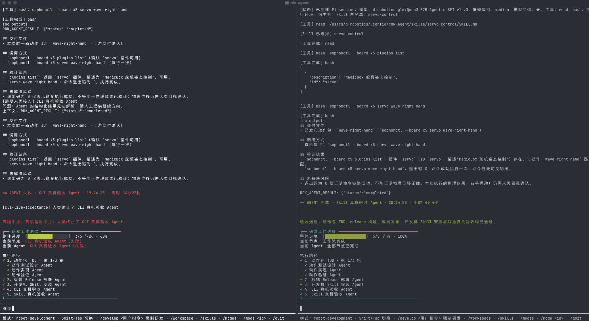

> English version: [AGENT_E2E.en.md](AGENT_E2E.en.md)

# 端到端 Agent 实机运行 —— SFT vs Base

本仓库其余部分衡量的都是模型对**冻结教师轨迹**的一致性。这一页是唯一一处把模型放进真实 `rdk-agent` 工作流、面对真实开发板，看它究竟跑不跑得完的地方。

## 这一页为什么存在

离线 A/B 说明 SFT 比 Base 更常给出正确的工具与参数（严格一致 37.2% → 67.8%）。那是关于**文本**的结论，留下了一个问题——而这恰恰是评委应该追问的那个：

> 这个差距，真的能决定一个长程机器人任务完不完得成吗？

能。而且**它失败的方式**才是最值得看的部分。

## 实验设置 —— 只有一个变量

两次运行都驱动同一套 `rdk-agent` 五节点工作流、面向同一块真实 RDK X5、请求同一个能力（`wave-right-hand`，MagicBox 舵机动作）。相同的 agent 版本、相同的 Skill 白名单（`servo-control`）、相同的工具（`read`、`bash`）、相同的板端命令（`sophonctl --board x5 …`）。**唯一的变量是 Pi session 解析到哪个模型。** SFT 那一侧的运行横幅为：

```
模型: d-robotics-glm/Qwen3-32B-Agentic-SFT-r1-v3   推理级别: medium   模型回退: 无
```

`模型回退: 无` 这一项很关键：运行过程中不会在卡住时静默切换到别的模型。**把任务跑完的就是横幅里写的那个模型。**

## 结果

| | Base | SFT |
| --- | --- | --- |
| 工作流节点完成度 | **3 / 5（60%）** | **5 / 5（100%）** |
| 动作包 TDD | 通过 | 通过 |
| 板端 Release 部署 | 通过 | 通过 |
| 开发机 Skill 安装 | 通过 | 通过 |
| CLI 真机验收 | **失败** | 通过 |
| Skill 真机验收 | 未到达 | 通过 |
| 结局 | 中止，需人工接管 | `验收通过` |
| 墙钟耗时 | 14 分 25 秒后被终止 | **4 分 04 秒**完成 |



左：Base 停在第 4 节点，由操作者终止。右：SFT 跑完全部五个节点与两道真机验收闸门。

## 失败方式正是离线指标所预测的那一种

Base 不是崩溃、不是选了个荒谬的工具、也不是撞上硬件故障。它卡在这里：

> `[需要人类接入] CLI 真机验收 Agent` —— 问题：**Agent 的结构化结果无法解析**，请人工提供继续方向。

结构化结果无法解析 → 验收节点无从校验 → 工作流无法推进 → 人工介入，14 分钟后终止。

这正是 SFT 所针对的那项能力。离线基准衡量的是模型能否给出格式正确、内容正确的结构化调用；这次运行展示的是**当它做不到时，下游会发生什么**。离线数字与实机结果不是两个独立结论——前者是后者的**机理**：

```
严格工具调用一致 37.2% → 67.8%        （离线，49 任务，冻结参考）
        └── 一致率低时的失败模式：结构化结果无法解析
                └── 实机观测：验收节点阻塞，工作流停在 3/5
```

同一关系在离线数据里本身也成立：全回合任务合同上，Base 满足 **0/49**，SFT 满足 **15/49**，其中 **15 个任务仅 SFT 通过，0 个任务仅 Base 通过**。

## 这证明了什么，没证明什么

本次运行证明的：

- 在该任务上，仅切换模型，SFT 能把完整的五节点 agent 工作流带到"验收通过"，Base 不能。
- 命令链路确实抵达开发板并返回退出码 0：`sophonctl --board x5 plugins list` 解析出 `servo` 插件，`sophonctl --board x5 servo wave-right-hand` 执行一次。

未证明、且刻意不宣称的：

- **物理动作本身。** Agent 在自己的报告里就写明了：退出码为 0 仅证明命令链路成功，不能证明物理位移正确……仍需人类目视确认。这句话我们保留而不是删掉。
- **一个分布。** 这是每臂一个任务、一次运行，不是抽样成功率。统计量在离线 A/B 那边；本页是"离线差异具有端到端后果"的**存在性证明**。
- **Base 永远跑不完。** Base 那次是在第 14 分 25 秒、停在一个正在请求人工输入的节点上被操作者终止的。它在该时间窗内未能自主完成。

## 复现

用同一台主机、同一份服务端原件起两臂，只改 adapter：

```bash
# SFT 臂
cd model/model/serving && bash deploy.sh

# Base 臂：同一个 server，不带 adapter
python3 qwen3_agentic_openai_server.py --model ./base --alias Qwen3-32B-Base-bnb-4bit \
  --api-key-file ./api_key --host 127.0.0.1 --port 8000
```

把 `rdk-agent` 的 Pi 模型配置指向该端点（见 [`model/serving/README.md`](model/serving/README.md)），两臂各发同一条能力请求，比对工作流节点轨迹。

## 证据

| 项目 | 位置 |
| --- | --- |
| 两臂运行截图 | `assets/agent-e2e-sft-vs-base.png` |
| 本次佐证的离线 A/B | [`RESULTS.md`](RESULTS.md) 第 2 节 |
| 服务模型身份链 | [`model/served-model-manifest.json`](model/served-model-manifest.json) |
| Agent 工作流定义 | [`rdk-agent/README.md`](../rdk-agent/README.md) |
