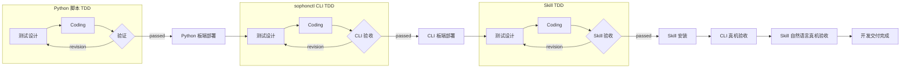
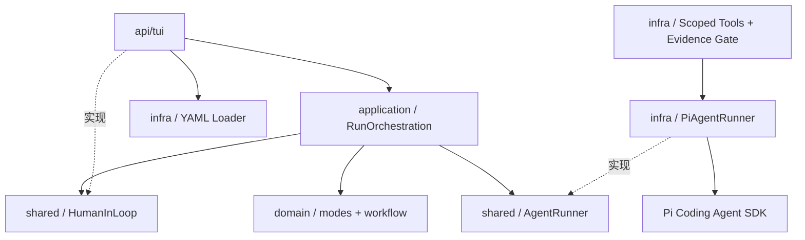

# RDK Agent 双模式编排设计

## 1. 背景与目标

`rdk-agent` 把自然语言机器人需求转换为可交付能力，并允许使用已交付 Skill 测试机器人应用效果。当前实现基于 Pi Coding Agent SDK 和 Pi TUI，同时保持领域与应用层不依赖具体 SDK 或界面。

设计目标：

- 以 TDD 小循环交付 Python 指令、sophonctl CLI 和 Skill；
- 测试设计、Coding、验证由不同 Agent 承担；
- 验证失败时自动返工，研发流程不以 Human-in-the-loop 阻塞；
- 支持机器人开发、机器人应用两种模式；
- 提示词、工具、Skill、循环和模式全部由文件配置；
- 开发测试进程运行在可配置的隔离环境，不依赖开发机 Python 包；
- 普通开发者无需获取 rdk-sophon 仓库，源码基线由 rdk-agent 配置中的版本化模板提供；
- 正常阶段自动执行，不设置人工审批门；
- 为 WebUI、桌面端和后续工作流能力保留稳定应用端口。

DAG、条件分支、Supervisor、人工审批和多方案竞争见 [`docs/TODO.md`](../TODO.md)，当前不实现。

## 2. 两种编排模式

### 2.1 机器人开发模式



三个小循环及其部署严格串行：

1. Python 循环交付 MagicBox Python 指令脚本，通过后由专用部署 Agent 原子部署到板端；
2. CLI 循环交付 sophonctl 动态插件接入，通过后部署 manifest 并只读检查插件注册；
3. Skill 循环交付并验收 `SKILL.md`，通过后安装到 rdk-agent 运行配置；
4. 最后分别执行 CLI 真机验收和加载新 Skill 的自然语言真机验收。

每个循环都执行：

```text
测试设计 Agent → Coding Agent → 验证 Agent
                              │
                revision ─────┘
```

验证 Agent 是静态验收边界：CLI 循环验证插件契约和调用链，Skill 循环验证自然语言映射与交付合同。部署 Agent 只负责固定目标的原子交付，不修改实现；真实动作集中在最后两个 acceptance Agent，避免测试、Coding 和部署阶段误驱动舵机。当前无位置反馈，命令 `exit=0` 是自动验收标准，只证明调用链成功，不等价于舵机物理位移已被测量。

开发阶段的 Bash 工具通过 Pi SDK 的可替换 `BashOperations` 路由到 X5 板端。每次 Bash 前，运行时把当前工作区打包到 `/userdata/rdk-agent/runs/<run-id>` 的一次性快照，然后使用 `systemd-run` 限制 CPU/内存/PID/时间，并在 `bwrap` 中执行命令。沙箱映射目标板 `/usr`、`/bin`、`/lib` 和工作区为只读，仅 `/tmp` 可写；使用 nobody 身份、独立网络/PID/IPC/UTS/user namespace，不映射 `/sys`、真实 `/dev` 或 GPIO/PWM/SPI 设备。命令中开发机工作区的绝对路径在运行前改写为 `/workspace`。命令结束后删除该 run-id 快照。Profile 的 `commandTimeoutSeconds` 另行限制单次 Bash（默认 30 秒），防止一个死循环耗尽整个 Agent 阶段预算。

测试 Agent 和 Coding Agent 的文件修改不经过板端 shell，而由开发机 Pi `edit/write` 工具按 `writePaths` 精确授权；下一次 Bash 会自动同步修改后的快照。这使测试使用目标板 Python 3.10 和系统兼容包，同时无法误操作真实硬件。部署、CLI 真机验收、Skill 真机验收和机器人应用模式不进入该沙箱。
为避免原始 Agent 命令中的开发机路径误导用户，TUI 的 tool-start 日志必须显示最终后端名称和改写后的 `/workspace` 命令。bwrap 内部在用户命令前输出一行运行标识，包含 target、cwd、uid、network 和 hardware 边界，作为日志级执行证据。

Pi Coding Agent 自身不提供内置安全沙箱。rdk-agent 在 SDK 适配层实现上述 SSH+bwrap 边界，而不是依赖提示词充当隔离；原有 Podman 适配器保留作为可配置后备。

### 2.1.1 开发者工作区获取

普通开发者不提供源码目录。启动时 `ManagedWorkspaceResolver` 读取 `workspace.kind: managed-template`，把配置目录中的 `templates/magicbox-servo` 原子复制到：

```text
${XDG_STATE_HOME:-~/.local/state}/rdk-agent/workspaces/<workspace.id>/v<workspace.version>
```

托管目录带 `.rdk-agent-workspace.json` 来源标记；重复启动校验标记和必需文件后复用，绝不覆盖开发者产生的代码。模板升级必须提高版本号，从而创建新目录。首次复制在同级临时目录完成，全部文件和元数据就绪后再原子 rename，避免中断留下半成品。

仓库贡献者可用 `rdk-agent --workspace <path>` 显式覆盖托管工程。该模式不会复制源码，只进行必需文件预检。两种模式进入应用层后都表现为同一个 `workspaceRoot`，所以 TDD、沙箱和部署不需要感知来源。

### 2.2 机器人应用模式

机器人应用模式只有一个 Agent。它只能看到该 Profile `skills` 配置中的严格白名单，根据 Skill frontmatter 的 `name` 和 `description` 匹配用户自然语言要求，完整读取一个或多个匹配的 `SKILL.md` 后组合调用并测试效果。

```text
用户应用需求
    ↓
机器人应用 Agent
    ├── 选择 Skill A
    ├── 选择 Skill B
    └── 组合测试效果
```

该模式把用户输入的动作式请求视为执行对应动作一次的授权。Agent 完成 Skill 要求的只读前置检查后直接调用 sophonctl，不能再次要求“确认真机”，也不能只显示帮助就结束。用户只询问能力、命令或状态时才保持只读；白名单中没有匹配 Skill、设备不可达或动作必填参数缺失时进入 Human-in-the-loop。

查询/动作分界不只依赖提示词。运行时先识别问号和“哪些、什么、怎么、查看、状态、配置、加载”等查询表达；只读查询的 Bash 工具只允许 `sophonctl plugins list`、插件 `--help`、版本和命令存在性检查，其他本地、远程或硬件命令在进程启动前拒绝。动作式表达才保持应用模式的一次真实执行授权。

## 3. DDD 分层



| 层 | 职责 |
|---|---|
| `domain` | Agent Profile、模式定义、TDD 循环定义和阶段状态不变量 |
| `application` | 模式调度、TDD 返工、交付传递和人类接入时机 |
| `shared` | `AgentRunner`、`HumanInLoop`、配置与事件端口 |
| `infra` | YAML 读取、Pi Session 创建、作用域工具、可执行验证证据和结构化结果解析 |
| `api/tui` | 模式切换、输入、进度展示和 Human-in-the-loop 交互 |

领域和应用层不读取文件、不创建 Pi Session，也不依赖终端组件。

## 4. 配置契约

### 4.1 目录结构

```text
~/.config/rdk-agent/
├── agents.yaml
├── skills/
│   └── <skill-name>/SKILL.md
└── templates/
    └── magicbox-servo/
        └── examples/plugins/servo/
            ├── servo_ctrl.py
            └── plugin.toml
```

配置目录优先级：

1. `--config-dir <dir>`；
2. `RDK_AGENT_CONFIG_DIR`；
3. 程序自带 `config/`。

### 4.2 Version 2

当前配置版本为 `2`：

```yaml
version: 2
defaultMode: robot-application
workspace:
  kind: managed-template
  id: magicbox-servo
  version: 2
  template: templates/magicbox-servo
    requiredPaths:
      - examples/plugins/servo/servo_ctrl.py
      - examples/plugins/servo/plugin.toml
      - examples/plugins/servo/tests/test_wave_hands.py

agents:
  - id: python-coding
    name: Python Coding Agent
    description: 依据测试实现 Python 指令
    tools: [read, bash, edit, write]
    writePaths: [examples/plugins/*/*.py]
    skills: [magicbox-command-authoring]
    timeoutSeconds: 300
    sandbox:
      kind: ssh-bwrap
      host: x5-root
      remoteRoot: /userdata/rdk-agent/runs
      network: none
      hardwareAccess: false
    systemPrompt: |
      你负责实现 Python 指令……

modes:
  - id: robot-development
    name: 机器人开发模式
    type: robot-development
    loops:
      - id: python
        name: Python 脚本 TDD
        deliverable: MagicBox Python 指令脚本
        testAgent: python-test
        codingAgent: python-coding
        verificationAgent: python-verification
        maxIterations: 3

  - id: robot-application
    name: 机器人应用模式
    type: robot-application
    agent: robot-application
```

### 4.3 校验规则

启动前必须通过以下校验：

- `version` 必须为 `2`；
- `defaultMode` 必须引用已存在模式；
- Agent、模式和同一模式中的循环 ID 不得重复；
- ID 只允许小写字母、数字和连字符；
- Agent 提示词、名称和描述不能为空；
- 工具只允许 `read`、`bash`、`edit` 和 `write`；
- 配置 `edit` 或 `write` 的 Agent 必须同时配置非空 `writePaths`；
- `writePaths` 是工作区相对 glob，可用前缀 `!` 排除更窄的路径；
- `workspace.kind: managed-template` 必须配置安全 ID、正整数版本、配置目录相对模板路径和必需文件；模板自身缺文件时启动失败；
- `workspace.requiredPaths` 定义研发模式必需业务文件；托管工程初始化和外部工程预检都使用同一清单；
- `sandbox.kind: ssh-bwrap` 必须提供安全 SSH host、板端绝对 `remoteRoot`、`network: none` 和显式 `hardwareAccess: false`；`podman` 仍可配置为本地后备，未配置 sandbox 的 Agent 继续在宿主机执行 Bash；
- `timeoutSeconds` 必须为正整数；可选的 `maxToolCalls` 配置后也必须为正整数，省略表示不限制工具调用次数；
- 模式引用的 Agent 必须存在；
- `maxIterations` 必须为正整数；
- Profile 引用的每个 Skill 必须存在对应 `SKILL.md`。
- `validation.kind: skill-contract` 必须同时提供交付目录、Skill 名、manifest、Python 入口、证据测试文件和基线 Skill；所有路径都必须是工作区相对路径。
- Skill 部署可用 `deployment.runtimeFiles` 指定运行时覆盖文件，当前必须包含 `SKILL.md`；部署会保留已安装目录中的 `acceptance.md` 等研发验收附件。

`skills` 是严格白名单而不是附加搜索目录。创建 Session 时禁用 Pi 的默认 Skill 发现，只加载这里列出的目录；加载结果中缺少任何配置项都会中止该 Agent 并进入 Human-in-the-loop。

配置修改在下次进程启动时生效，不进行运行中热加载。

## 5. TDD 循环语义

### 5.1 循环步骤

应用用例对每个循环执行：

1. 运行测试设计 Agent，创建或修订测试；
2. 运行 Coding Agent，依据测试完成最小实现；
3. 运行验证 Agent，执行只读检查和安全测试；
4. 验证通过则交付给下一循环；
5. 验证要求返工则从测试设计重新开始。

返工重新运行全部三个 Agent，而不是只重跑 Coding。这允许测试 Agent 根据验证反馈修订错误或不完整的测试设计。

### 5.2 自动返工上限

每个循环通过 `maxIterations` 配置自动返工次数。达到上限仍未通过时以带验证反馈的失败结果结束，不暂停请求人类输入：

```text
达到自动返工上限
    ↓
输出确定性失败原因
    ↓
结束本次运行，保留工作区和日志供下一次自动回归
```

测试、Coding、验证这三类无外部副作用的 Agent 若遇到 Session 异常或误报 `needs-human`，编排器会携带错误上下文自动重试两次。部署和真机验收不自动重试，避免重复安装或重复物理动作；它们失败时直接结束工作流并报告原因。

### 5.3 串行交付

`DeliveryWorkflow` 以循环 ID 作为领域阶段，保证前一个循环成功后才能开始下一个循环。循环内部的 Agent 可以重复运行，但循环自身只发生一次 `pending → running → succeeded/failed` 状态转换。

### 5.4 验证证据与确定性交付合同

LLM 返回 `passed` 不是充分条件。验证 Agent 必须在当前 Session 内实际运行配置要求的安全测试；没有 Bash 证据、最近一次测试失败或仅口头声称通过，Runner 都不会放行。

Skill 验证还可通过 Profile 的 `validation: { kind: skill-contract, ... }` 启用确定性合同校验。当前 MagicBox 适配器会直接读取交付 `SKILL.md`、`acceptance.md`、`plugin.toml`、Python 入口、证据测试及已安装基线 Skill，核对：

- Skill frontmatter 可被 Pi 加载，且没有丢失既有动作；
- 自然语言映射生成完整的 `sophonctl <plugin> <action>` 命令；
- acceptance 引用的测试真实存在，且结论没有超出对应断言；
- manifest 不被误当作自然语言映射或参数 schema；
- 参数、shell、权限、资源清理和物理效果等未验证事实没有被写成已证明结论。

任一项失败时，即使 Agent 输出 `passed`，Runner 也会将结果改写为带全部问题的 `revision`，从测试设计 Agent 重新开始当前小循环。

## 6. Agent 结构化结果

自由文本不足以可靠控制返工。Runner 会在每次提示末尾加入结果契约，要求 Agent 最后一行输出单行 JSON。

工作或应用 Agent：

```text
RDK_AGENT_RESULT: {"status":"completed"}
RDK_AGENT_RESULT: {"status":"failed","feedback":"自动流程无法继续的具体原因"}
RDK_AGENT_RESULT: {"status":"needs-human","question":"需要人类回答的问题"}
```

验证 Agent：

```text
RDK_AGENT_RESULT: {"status":"passed"}
RDK_AGENT_RESULT: {"status":"revision","feedback":"需要返工的问题"}
RDK_AGENT_RESULT: {"status":"needs-human","question":"需要人类回答的问题"}
```

`PiAgentRunner` 将结果转换为与 SDK 无关的领域输入：

| Agent 输出 | `AgentOutcome` | 调度行为 |
|---|---|---|
| `completed` / `passed` | `completed` | 进入下一步骤 |
| `revision` | `revision` | 重新开始当前 TDD 循环 |
| `failed` | `failed` | 不请求人类；无副作用阶段可自动恢复，副作用阶段直接失败结束 |
| `needs-human` | `needs-human` | 研发的安全阶段自动恢复；部署/真机阶段失败结束；应用模式可请求人类输入 |

工作 Agent 缺少结果标记时暂按 `completed` 处理，以兼容普通 Pi 输出；验证 Agent 缺少或返回无效标记时不能默认为通过，由验证证据规则触发补跑或返工。

## 7. Human-in-the-loop 边界

机器人研发模式不触发 Human-in-the-loop。可安全阶段自动恢复，具有部署或硬件副作用的阶段失败即结束。`HumanInLoop` 端口仅保留给机器人应用模式中真正缺失且无法从 Skill、工作区或设备状态得到的信息，例如动作必填参数缺失。

### 7.2 应用端口

应用层依赖 `HumanInLoop`：

```ts
interface HumanInLoop {
  requestInput(request: HumanInputRequest): Promise<HumanInputResponse>;
}
```

TUI 是当前端口实现。未来 WebUI 可以用 WebSocket 或持久化待处理请求实现同一端口。

### 7.3 TUI 交互

机器人应用模式进入 Human-in-the-loop 时：

1. 日志显示 Agent、问题和阻塞上下文；
2. Editor 从禁用状态恢复；
3. 人类输入普通文本后，内容作为新的上游交付传给重试 Agent；
4. 输入 `/abort` 终止当前工作流。

Human-in-the-loop 不是人工审批，也不是研发失败的默认兜底。

## 8. Pi Session 与交接

每次 Agent 调用创建独立内存 Session：

- `cwd` 是用户选择的工作目录；
- rdk-agent 当前不为 Profile 单独指定模型，`createAgentSession` 从 Pi 的 `~/.pi/agent/settings.json` 解析默认 provider、model 和推理级别；Session 创建日志输出最终实际值及是否发生回退；
- Pi 内置工具全部关闭，只注册当前 Profile 声明的作用域工具；
- `edit` 和 `write` 在工具实现层校验 `writePaths`，越界写入即使提示词允许也会被拒绝；
- `bash` 只用于测试和只读检查，拒绝重定向以及常见文件修改、安装和 Git 写操作，并设置 `PYTHONDONTWRITEBYTECODE=1`；
- Profile 的 `systemPrompt` 追加到 Pi 默认提示词；
- 禁用 Pi 默认 Skill 发现，只把 Profile 的 `skills` 作为严格白名单加载；
- Pi 系统提示只展示白名单 Skill 的名称、描述和路径，Agent 根据当前需求选择匹配项；
- Agent 必须通过 `read` 完整读取每个选中的 `SKILL.md`；读取事件形成可观测的“本次选择”，不固定使用列表第一项；
- Session 完成后取消订阅并释放。

每个 Profile 仍由 `timeoutSeconds` 限制阶段总时长。`maxToolCalls` 是可选保护项；当前所有 Agent 均省略该配置，因此不限制工具调用次数。以后若为单个 Profile 重新配置正整数上限，超过后才会中止 Session 并进入 Human-in-the-loop。

### 8.1 验证证据门

验证 Agent 的文本结论不是通过依据。Runner 会记录该 Session 的 Bash 工具证据：

1. 返回 `passed` 但没有调用 Bash 时，在同一 Session 内强制补跑一次对应的 mock/静态测试；
2. 仍没有 Bash 证据时把结论改为 `revision`；
3. 任一 Bash 工具返回错误时，即使 Agent 文本写了 `passed`，也把结论改为 `revision`；
4. 只有实际 Bash 检查成功且结构化状态为 `passed` 时，循环才能进入下一阶段。

该门禁解决了验证 Agent 只读代码后口头宣布成功，以及测试失败后仍误报成功的问题。

应用层把已完成 Agent 的交付文本、人类补充和循环反馈加入 `previousDeliveries`。每项交付传给下游时最多取末尾 6000 字符；共享工作目录中的文件仍是交付事实来源。

## 9. 运行事件

应用层发布：

| 事件 | 用途 |
|---|---|
| `workflow-started` | 模式和需求开始 |
| `loop-iteration` | 展示循环名称和迭代次数 |
| `stage-status` | Agent 的运行、成功或失败状态 |
| `agent-event` | 模型文本、工具开始和工具结束 |
| `skills-loaded` | 当前 Session 实际加载的严格 Skill 白名单 |
| `skill-selected` | Agent 本次读取并选择使用的 Skill |
| `human-input-required` | 通知 UI 工作流暂停 |
| `human-input-received` | 记录人类补充内容 |
| `workflow-finished` | 输出最终成功或失败 |

UI 只依赖这些事件，不需要理解 Pi SDK 事件结构。

## 10. TUI 设计

### 10.1 页面结构

```text
当前模式标题
当前模式涉及的 Agent、状态及 Skill 配置/加载/选择
循环、模型、工具和 Human-in-the-loop 日志
Editor
模式与快捷命令提示
```

Editor 挂载后必须调用 `tui.setFocus(editor)`，否则输入不会进入文本框。

### 10.2 命令

| 命令 | 行为 |
|---|---|
| `Shift+Tab` | 同时按下，循环切换配置中的模式 |
| `/skills` | 显示当前 Agent 配置、实际加载和本次选择的 Skill |
| `/modes` | 显示可用模式和当前模式 |
| `/mode robot-development` | 切换机器人开发模式 |
| `/mode robot-application` | 切换机器人应用模式 |
| `/clear` | 清空日志 |
| `/abort` | Human-in-the-loop 等待期间终止 |
| `/quit` | 退出并恢复终端 |

TUI 默认进入机器人应用模式。模式只能在空闲时切换；工作流运行期间 Editor 被禁用，只有 Human-in-the-loop 会临时恢复输入，此时 Shift+Tab 不切换模式。单独按 Tab 不负责模式切换，继续由 Editor 处理。

## 11. 权限与安全

- 测试与 Coding Agent 只能写 `writePaths` 明确分配的交付物；测试、生产代码、CLI manifest 和 Skill 互不越权；
- 验证 Agent 没有 `edit`、`write`，只能读取和运行安全验证；
- 机器人应用 Agent 默认只读，但可用 Bash 调用已交付 Skill 的安全或模拟命令；
- 机器人应用模式的查询请求有独立 Bash 硬门禁，提示词误判也不能启动动作、SSH 或其他任意命令；
- 真实设备访问仍必须经过 `Skill → sophonctl → probe-daemon → 插件`；
- 配置文件可以扩大 Agent 权限，因此应只允许可信用户修改；
- 当前没有人工审批门，连接真实机器人前仍需后续审批与目标白名单能力。
- 开发测试容器不能读取宿主 HOME、SSH 凭据或全局 Python 包，业务工作区在容器内只读；容器镜像必须预先拉取，运行阶段使用 `--pull=never`，不会临时联网改变环境。

## 12. 部署与配置迁移

默认路径：

```text
~/.local/share/rdk-agent   程序
~/.local/bin/rdk-agent    命令
~/.config/rdk-agent       用户配置
~/.local/state/rdk-agent/workspaces  版本化托管开发工程
```

部署脚本先在临时目录安装，再替换程序。配置升级策略：

- 配置目录不存在：初始化 Version 2 默认配置；
- 用户配置与旧安装包默认配置完全一致：自动升级；
- 用户修改过配置：保留原文件，并写入 `agents.yaml.v2.example` 供人工合并。

程序重新部署只替换安装目录和默认配置，不删除 `XDG_STATE_HOME` 下的托管工程。

## 13. 测试策略

自动测试覆盖：

- 领域阶段顺序和失败状态；
- 验证失败后的完整 TDD 重跑；
- 研发阶段异常和误报 `needs-human` 的有界自动恢复，以及部署阶段不重复副作用；
- 应用模式 `needs-human` 暂停和人类 `/abort` 语义；
- 开发与应用模式配置解析；
- 板端 SSH+bwrap 沙箱的快照同步、离线/只读/无硬件边界、资源限制、路径改写和越界目录拒绝；
- Podman 后备适配器的离线、只读挂载和越界工作目录拒绝；
- 研发 workspace 必需文件检查与正确项目目录建议；
- 内置模板的首次原子初始化、版本化路径、来源标记、重复启动复用和显式外部工程覆盖；
- 配置引用和 Skill 文件校验。
- Skill 严格白名单、动态选择事件和 `/skills` 状态格式；
- 应用查询/动作分类及只读 Bash 硬门禁；
- Agent 写路径白名单、排除规则和只读 Bash 策略；
- 验证 Agent 缺少 Bash 证据、Bash 失败和同 Session 补跑；
- Skill 确定性交付合同对错误命令、虚假参数限制、错误测试归属、缺失元数据和既有能力丢失的拒绝；
- 舵机 Skill 的动作列表、自然语言映射和物理验收分界。

```sh
npm run check
npm test
```

PTY 冒烟测试还应验证模式切换、Editor 输入、Human-in-the-loop 恢复输入以及 Ctrl-C 终端恢复。

### 13.1 `wave-hands` 端到端样例

本轮用“先动左手再动右手”验证了完整机器人开发模式：

1. Python 测试 Agent 交付共享 Mock 的严格调用顺序测试；
2. Python Coding Agent 复用原子能力实现 `lift_left → lower_left → lift_right → lower_right`；
3. Python 验证 Agent 实际运行 mock 测试；
4. CLI 测试 Agent 验证 `plugin.toml`、`ACTIONS` 和 `main()` 分发；
5. CLI Coding/验证 Agent 完成并运行合同测试；
6. Skill 测试/Coding Agent 交付自然语言映射与安全规则；
7. Skill 验证 Agent 重新运行 Python 和 CLI 测试后通过。

旧版外部独立回归中，CLI 测试 Agent 和 Skill Coding Agent 曾达到当时配置的工具调用上限，并暂停到 Human-in-the-loop。当前版本已按使用反馈取消所有 Agent 的工具次数上限，仅保留阶段超时；这一历史样例不再代表当前运行行为。

### 13.2 `wave-left-hand` 端到端样例

以“开发一个挥动左手的功能”运行完整 TUI 研发模式，实际经过 Python TDD、Python 板端部署、CLI TDD、CLI 板端部署、Skill TDD、Skill 安装、CLI 真机验收和 Skill 自然语言真机验收。Python 专项测试 2 项、CLI 合同测试 9 项均通过；脚本和 manifest 部署返回板端校验和，插件列表包含 `servo`；最后两条 `sophonctl --board x5 servo wave-left-hand` 均返回 `exit=0`。软件链路据此通过；该设备链路未采集舵机位置反馈，因此不把 exit=0 扩大解释为物理位移测量。

该样例也覆盖了两个曾导致流程停滞的问题：Skill 验收文档的过度推断会被确定性合同改写为 `revision`；Coding Agent 对同一处精确 edit 连续失败时必须停止重试，文件已满足需求可零修改完成，确需修改则重新读取后最多整文件 write 一次。

Skill 安装只覆盖配置声明的运行时文件 `SKILL.md`，不会再用研发交付目录整体替换已安装 Skill，因此配置仓库中的标准 `acceptance.md` 会被保留。

### 13.3 `wave-right-hand` 全自动端到端回归

2026-08-04 使用无交互入口运行：

```sh
rdk-agent --mode robot-development --request "帮我实现一个挥动右手的功能"
```

首轮暴露出模型把右手需求写入左手测试的问题，因此新增 `servo-python-test` 确定性校验，绑定用户侧别、测试文件、方法、动作名和单侧集合。正式回归中，校验先后拦截了缺少独立 `test_wave_right_hand_is_right_only_action` 和缺少左侧零调用证据的两份不完整测试，第三轮形成 3 个测试后才进入 Coding。

最终 Python 3 项与 CLI 3 项测试都在 X5 离线 bwrap 沙箱通过；Python 和 manifest 原子部署成功，插件列表包含 `servo`，Skill 静态合同和安装通过。CLI 真机 Agent 与 Skill 自然语言真机 Agent 各执行一次 `sophonctl --board x5 servo wave-right-hand`，均返回 exit=0，整个运行没有 Human-in-the-loop。此结果证明自动研发、部署和命令链路完整；由于未采集舵机位置反馈，不把它表述为对实际角度的闭环测量。

### 13.4 复合舵机动作的可见停留契约

一次左手回归曾出现命令 exit=0、调用耗时正常，但舵机肉眼无动作。根因是生成的 `wave_left_hand()` 在 `lift_left()` 后仅继承原子方法内部 50ms 等待，随即调用 `lower_left()`；主程序默认 `--hold 1.0` 保持的是已经放下的位置。50Hz 下 50ms 只有约 2–3 个 PWM 周期，不能作为肉眼可见动作的充分条件。

复合动作现在必须满足 `lift → visible hold → lower`，默认可见停留为 0.8 秒。v2 静态入口直接使用 `WAVE_POSITION_HOLD_SECONDS`；v3 托管动作调用入口统一提供的 `hold_visible_position()`，并由 `servo_actions/actions.json` 的 `start` 表达左右侧，不能再要求新动作进入静态 `ACTIONS` 或单侧集合。Python 测试将 visible hold 纳入共享 Mock 的严格调用顺序，`servo-python-test` 确定性校验同时兼容这两种架构。真机 Agent 的 exit=0 仅作为插件命令链路证据，禁止再声称物理响应由硬件自动保证。

提示词之外，`magicbox-command-authoring/references/servo-atomic-contract.md` 固化了 50Hz/50ms、当前左右引脚映射、`--hold` 的发生位置及无位置反馈时的验收边界。测试 Agent 的交付还会经过确定性合同检查，因此模型漏读或误解这些规则时会进入返工，而不会继续部署。

## 14. 当前限制

- 三个开发循环仍然串行；
- 每个 Profile 只主动展开第一个 Skill；
- Agent 结构化结果依赖文本尾部协议，不是 Provider 原生结构化输出；
- 工作流、日志和 Human 请求没有持久化；
- 没有在普通 Agent 运行期间取消 Pi Session 的 UI 操作；
- 机器人应用 Agent 通过文件发现已交付 Skill，尚无结构化 Skill 注册表；
- 配置只在启动时加载。
- 开发 Bash 已使用操作系统级 SSH+bwrap 沙箱；部署、真机验收和应用模式仍依赖命令白名单、Profile 工具边界与板端权限。
- 验证证据当前只记录 Bash 是否执行及工具级错误，尚未形成可持久化、可复核的结构化测试报告。
- `skill-contract` 当前是 MagicBox servo 的确定性适配器，不是任意 Skill 的通用语义证明器；新增硬件域需要新增对应合同规则。

后续路线统一记录在 [`docs/TODO.md`](../TODO.md)。
