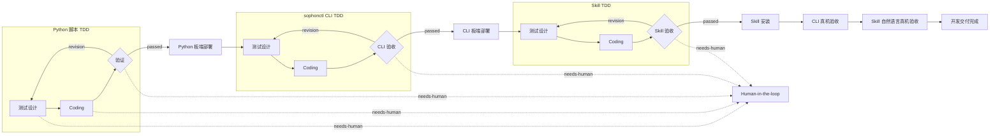
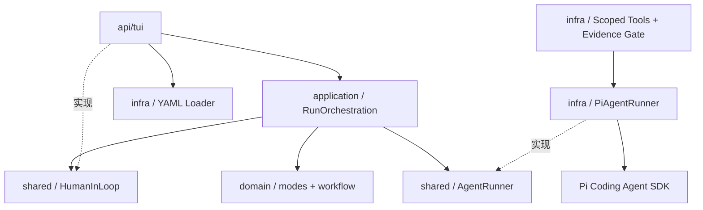

# RDK Agent 双模式编排设计

## 1. 背景与目标

`rdk-agent` 把自然语言用户指令转换为可交付的机器人能力，并允许使用已交付 Skill 测试机器人应用效果。当前实现基于 Pi Coding Agent SDK 和 Pi TUI，同时保持领域与应用层不依赖具体 SDK 或界面。

设计目标：

- 以 TDD 小循环交付 Python 指令、sophonctl CLI 和 Skill；
- 测试设计、Coding、验证由不同 Agent 承担；
- 验证失败时自动返工，无法继续时请求人类接入；
- 支持机器人开发、机器人应用两种模式；
- 提示词、工具、Skill、循环和模式全部由文件配置；
- 开发测试进程运行在可配置的隔离环境，不依赖开发机 Python 包；
- 普通开发者无需获取 rdk-sophon 仓库，源码基线由 rdk-agent 配置中的版本化模板提供；
- 正常阶段自动执行，不设置人工审批门；
- 为 WebUI、桌面端和后续工作流能力保留稳定应用端口。

DAG、条件分支、Supervisor、人工审批和多方案竞争见 [`docs/TODO.md`](../TODO.md)，当前不实现。

## 2. 两种编排模式

### 2.1 机器人开发模式



三个小循环及其部署严格串行：

1. Python 循环交付 MagicBox Python 指令脚本，通过后由专用部署 Agent 原子部署到板端；
2. CLI 循环交付 sophonctl 动态插件接入，通过后部署 manifest 并只读检查插件注册；
3. Skill 循环交付并验收 `SKILL.md`，通过后安装到 rdk-agent 运行配置；
4. 最后分别执行 CLI 真机验收和加载新 Skill 的自然语言真机验收。

每个循环都执行：

```text
测试设计 Agent → Coding Agent → 验证 Agent
                              │
                revision ─────┘
```

验证 Agent 是静态验收边界：CLI 循环验证插件契约和调用链，Skill 循环验证自然语言映射与交付合同。部署 Agent 只负责固定目标的原子交付，不修改实现；真实动作集中在最后两个 acceptance Agent，避免测试、Coding 和部署阶段误驱动舵机。命令 `exit=0` 只能证明调用链成功，实际舵机位移仍由现场人类观察。

开发阶段的 Bash 工具通过 Pi SDK 的可替换 `BashOperations` 路由到 Podman。容器固定使用 Python 3.12、关闭网络、删除 capabilities、限制 CPU/内存/PID，根文件系统和业务工作区均只读，仅容器内 `/tmp` 可写。宿主工作区统一映射到容器的 `/workspace`，运行时会将 Agent 命令中的工作区绝对路径改写为该路径，避免依赖 macOS 与 Podman VM 拥有相同的目录树。测试 Agent 和 Coding Agent 的文件修改不经过容器 shell，而由宿主 Pi `edit/write` 工具按 `writePaths` 精确授权，因此测试进程既不能污染开发机 Python 环境，也不能绕过文件白名单修改代码。部署、CLI 真机验收、Skill 真机验收和机器人应用模式不进入该容器，它们仍需访问宿主的 `ssh`、`sophonctl` 与设备连接。

Pi Coding Agent 自身不提供内置安全沙箱；官方提供的是 Gondolin、容器、OpenShell 和 sandbox-runtime 示例。rdk-agent 在 SDK 适配层实现上述 Podman 边界，而不是依赖 Project Trust 或提示词充当隔离。

### 2.1.1 开发者工作区获取

普通开发者不提供源码目录。启动时 `ManagedWorkspaceResolver` 读取 `workspace.kind: managed-template`，把配置目录中的 `templates/magicbox-servo` 原子复制到：

```text
${XDG_STATE_HOME:-~/.local/state}/rdk-agent/workspaces/<workspace.id>/v<workspace.version>
```

托管目录带 `.rdk-agent-workspace.json` 来源标记；重复启动校验标记和必需文件后复用，绝不覆盖开发者产生的代码。模板升级必须提高版本号，从而创建新目录。首次复制在同级临时目录完成，全部文件和元数据就绪后再原子 rename，避免中断留下半成品。

仓库贡献者可用 `rdk-agent --workspace <path>` 显式覆盖托管工程。该模式不会复制源码，只进行必需文件预检。两种模式进入应用层后都表现为同一个 `workspaceRoot`，所以 TDD、沙箱和部署不需要感知来源。

### 2.2 机器人应用模式

机器人应用模式只有一个 Agent。它只能看到该 Profile `skills` 配置中的严格白名单，根据 Skill frontmatter 的 `name` 和 `description` 匹配用户自然语言要求，完整读取一个或多个匹配的 `SKILL.md` 后组合调用并测试效果。

```text
用户应用指令
    ↓
机器人应用 Agent
    ├── 选择 Skill A
    ├── 选择 Skill B
    └── 组合测试效果
```

该模式把用户输入的动作式请求视为执行对应动作一次的授权。Agent 完成 Skill 要求的只读前置检查后直接调用 sophonctl，不能再次要求“确认真机”，也不能只显示帮助就结束。用户只询问能力、命令或状态时才保持只读；白名单中没有匹配 Skill、设备不可达或动作必填参数缺失时进入 Human-in-the-loop。

### 2.3 研发输入意图门禁

机器人研发模式表示当前可用的工作方式，不等于每条输入都是研发授权。TUI 和 headless 入口在 workspace 预检及 `RunOrchestration` 之前统一调用 `RouteUserRequest`：

```text
用户输入 → 确定性问候规则 → 无工具意图分类 Session
                              ├─ development → workspace 预检 → 研发工作流
                              ├─ conversation → 对话响应，流程不启动
                              ├─ clarification → 等待补充，流程不启动
                              └─ unsupported-development → 说明能力边界
```

分类 Session 使用内存会话，禁用全部工具、Extensions、Skills、Prompt 模板、主题和项目上下文，只接收当前模式能力摘要及不可信的用户文本。结果必须符合严格 JSON 契约；缺少标记、未知枚举、非法置信度、超时或模型异常全部安全降级为 `clarification`。只有达到 `intake.autoStartConfidence` 且明确要求受支持研发工作的用户指令才自动放行。`/develop <用户指令>` 表示用户已明确授权，可跳过分类。

查询/动作分界不只依赖提示词。运行时先识别问号和“哪些、什么、怎么、查看、状态、配置、加载”等查询表达；只读查询的 Bash 工具只允许 `sophonctl plugins list`、插件 `--help`、版本和命令存在性检查，其他本地、远程或硬件命令在进程启动前拒绝。动作式表达才保持应用模式的一次真实执行授权。

## 3. DDD 分层



| 层 | 职责 |
|---|---|
| `domain` | Agent Profile、模式定义、TDD 循环定义和阶段状态不变量 |
| `application` | 模式调度、TDD 返工、交付传递和人类接入时机 |
| `shared` | `AgentRunner`、`HumanInLoop`、配置与事件端口 |
| `infra` | YAML 读取、Pi Session 创建、作用域工具、可执行验证证据和结构化结果解析 |
| `api/tui` | 模式切换、输入、进度展示和 Human-in-the-loop 交互 |

领域和应用层不读取文件、不创建 Pi Session，也不依赖终端组件。

## 4. 配置契约

### 4.1 目录结构

```text
~/.config/rdk-agent/
├── agents.yaml
├── skills/
│   └── <skill-name>/SKILL.md
└── templates/
    └── magicbox-servo/
        └── examples/plugins/servo/
            ├── servo_ctrl.py
            └── plugin.toml
```

配置目录优先级：

1. `--config-dir <dir>`；
2. `RDK_AGENT_CONFIG_DIR`；
3. 程序自带 `config/`。

### 4.2 Version 2

当前配置版本为 `2`：

```yaml
version: 2
defaultMode: robot-application
intake:
  autoStartConfidence: 0.9
  timeoutSeconds: 30
  developmentScope: 当前流程只支持机器人舵机动作包研发。
workspace:
  kind: managed-template
  id: magicbox-servo
  version: 2
  template: templates/magicbox-servo
  requiredPaths:
    - examples/plugins/servo/servo_ctrl.py
    - examples/plugins/servo/plugin.toml

agents:
  - id: python-coding
    name: Python Coding Agent
    description: 依据测试实现 Python 指令
    tools: [read, bash, edit, write]
    writePaths: [examples/plugins/*/*.py]
    skills: [magicbox-command-authoring]
    timeoutSeconds: 300
    systemPrompt: |
      你负责实现 Python 指令……

modes:
  - id: robot-development
    name: 机器人开发模式
    type: robot-development
    loops:
      - id: python
        name: Python 脚本 TDD
        deliverable: MagicBox Python 指令脚本
        testAgent: python-test
        codingAgent: python-coding
        verificationAgent: python-verification
        maxIterations: 3

  - id: robot-application
    name: 机器人应用模式
    type: robot-application
    agent: robot-application
```

### 4.3 校验规则

启动前必须通过以下校验：

- `version` 必须为 `2`；
- `defaultMode` 必须引用已存在模式；
- `intake.autoStartConfidence` 必须大于 `0` 且不超过 `1`，`timeoutSeconds` 必须为正整数，`developmentScope` 必须为非空文本；省略 `intake` 时使用安全默认值；
- Agent、模式和同一模式中的循环 ID 不得重复；
- ID 只允许小写字母、数字和连字符；
- Agent 提示词、名称和描述不能为空；
- 工具只允许 `read`、`bash`、`edit` 和 `write`；
- 配置 `edit` 或 `write` 的 Agent 必须同时配置非空 `writePaths`；
- `writePaths` 是工作区相对 glob，可用前缀 `!` 排除更窄的路径；
- `workspace.kind: managed-template` 必须配置安全 ID、正整数版本、配置目录相对模板路径和必需文件；模板自身缺文件时启动失败；
- `workspace.requiredPaths` 定义研发模式必需业务文件；托管工程初始化和外部工程预检都使用同一清单；
- `sandbox.kind: podman` 必须提供安全的镜像引用且 `network` 当前只能为 `none`；未配置 sandbox 的 Agent 继续在宿主机执行 Bash；
- `timeoutSeconds` 必须为正整数；可选的 `maxToolCalls` 配置后也必须为正整数，省略表示不限制工具调用次数；
- 模式引用的 Agent 必须存在；
- `maxIterations` 必须为正整数；
- Profile 引用的每个 Skill 必须存在对应 `SKILL.md`。
- `validation.kind: skill-contract` 必须同时提供交付目录、Skill 名、manifest、Python 入口、证据测试文件和基线 Skill；所有路径都必须是工作区相对路径。
- Skill 部署可用 `deployment.runtimeFiles` 指定运行时覆盖文件，当前必须包含 `SKILL.md`；部署会保留已安装目录中的 `acceptance.md` 等研发验收附件。

`skills` 是严格白名单而不是附加搜索目录。创建 Session 时禁用 Pi 的默认 Skill 发现，只加载这里列出的目录；加载结果中缺少任何配置项都会中止该 Agent 并进入 Human-in-the-loop。

配置修改在下次进程启动时生效，不进行运行中热加载。

## 5. TDD 循环语义

### 5.1 循环步骤

应用用例对每个循环执行：

1. 运行测试设计 Agent，创建或修订测试；
2. 运行 Coding Agent，依据测试完成最小实现；
3. 运行验证 Agent，执行只读检查和安全测试；
4. 验证通过则交付给下一循环；
5. 验证要求返工则从测试设计重新开始。

返工重新运行全部三个 Agent，而不是只重跑 Coding。这允许测试 Agent 根据验证反馈修订错误或不完整的测试设计。

### 5.2 自动返工上限

每个循环通过 `maxIterations` 配置自动返工次数。达到上限仍未通过时不会直接失败，而是请求人类输入：

```text
达到自动返工上限
    ↓
暂停工作流
    ↓
人类补充方向 ──→ 重新获得一组自动返工预算
    └─ /abort ──→ 终止工作流
```

### 5.3 串行交付

`DeliveryWorkflow` 以循环 ID 作为领域阶段，保证前一个循环成功后才能开始下一个循环。循环内部的 Agent 可以重复运行，但循环自身只发生一次 `pending → running → succeeded/failed` 状态转换。

### 5.4 验证证据与确定性交付合同

LLM 返回 `passed` 不是充分条件。验证 Agent 必须在当前 Session 内实际运行配置要求的安全测试；没有 Bash 证据、最近一次测试失败或仅口头声称通过，Runner 都不会放行。

Skill 验证还可通过 Profile 的 `validation: { kind: skill-contract, ... }` 启用确定性合同校验。当前 MagicBox 适配器会直接读取交付 `SKILL.md`、`acceptance.md`、`plugin.toml`、Python 入口、证据测试及已安装基线 Skill，核对：

- Skill frontmatter 可被 Pi 加载，且没有丢失既有动作；
- 自然语言映射生成完整的 `sophonctl <plugin> <action>` 命令；
- acceptance 引用的测试真实存在，且结论没有超出对应断言；
- manifest 不被误当作自然语言映射或参数 schema；
- 参数、shell、权限、资源清理和物理效果等未验证事实没有被写成已证明结论。

任一项失败时，即使 Agent 输出 `passed`，Runner 也会将结果改写为带全部问题的 `revision`，从测试设计 Agent 重新开始当前小循环。

## 6. Agent 结构化结果

自由文本不足以可靠控制返工和人类接入。Runner 会在每次提示末尾加入结果契约，要求 Agent 最后一行输出单行 JSON。

工作或应用 Agent：

```text
RDK_AGENT_RESULT: {"status":"completed"}
RDK_AGENT_RESULT: {"status":"needs-human","question":"需要人类回答的问题"}
```

验证 Agent：

```text
RDK_AGENT_RESULT: {"status":"passed"}
RDK_AGENT_RESULT: {"status":"revision","feedback":"需要返工的问题"}
RDK_AGENT_RESULT: {"status":"needs-human","question":"需要人类回答的问题"}
```

`PiAgentRunner` 将结果转换为与 SDK 无关的领域输入：

| Agent 输出 | `AgentOutcome` | 调度行为 |
|---|---|---|
| `completed` / `passed` | `completed` | 进入下一步骤 |
| `revision` | `revision` | 重新开始当前 TDD 循环 |
| `needs-human` | `needs-human` | 暂停并请求人类输入 |

工作 Agent 缺少结果标记时暂按 `completed` 处理，以兼容普通 Pi 输出；验证 Agent 缺少或返回无效标记时进入 Human-in-the-loop，不能默认为通过。

## 7. Human-in-the-loop

### 7.1 触发条件

- Agent 主动返回 `needs-human`；
- Pi Session 或工具执行抛出异常；
- 验证返工达到 `maxIterations`；
- 结构化验证结论无法解析。

### 7.2 应用端口

应用层依赖 `HumanInLoop`：

```ts
interface HumanInLoop {
  requestInput(request: HumanInputRequest): Promise<HumanInputResponse>;
}
```

TUI 是当前端口实现。未来 WebUI 可以用 WebSocket 或持久化待处理请求实现同一端口。

### 7.3 TUI 交互

进入 Human-in-the-loop 时：

1. 日志显示 Agent、问题和阻塞上下文；
2. Editor 从禁用状态恢复；
3. 人类输入普通文本后，内容作为新的上游交付传给重试 Agent；
4. 输入 `/abort` 终止当前工作流。

Human-in-the-loop 不是人工审批。正常测试、Coding 和验证步骤默认自动执行。

## 8. Pi Session 与交接

每次 Agent 调用创建独立内存 Session：

- `cwd` 是用户选择的工作目录；
- rdk-agent 当前不为 Profile 单独指定模型，`createAgentSession` 从 Pi 的 `~/.pi/agent/settings.json` 解析默认 provider、model 和推理级别；Session 创建日志输出最终实际值及是否发生回退；
- Pi 内置工具全部关闭，只注册当前 Profile 声明的作用域工具；
- `edit` 和 `write` 在工具实现层校验 `writePaths`，越界写入即使提示词允许也会被拒绝；
- `bash` 只用于测试和只读检查，拒绝重定向以及常见文件修改、安装和 Git 写操作，并设置 `PYTHONDONTWRITEBYTECODE=1`；
- Profile 的 `systemPrompt` 追加到 Pi 默认提示词；
- 禁用 Pi 默认 Skill 发现，只把 Profile 的 `skills` 作为严格白名单加载；
- Pi 系统提示只展示白名单 Skill 的名称、描述和路径，Agent 根据当前用户指令选择匹配项；
- Agent 必须通过 `read` 完整读取每个选中的 `SKILL.md`；读取事件形成可观测的“本次选择”，不固定使用列表第一项；
- Session 完成后取消订阅并释放。

每个 Profile 仍由 `timeoutSeconds` 限制阶段总时长。`maxToolCalls` 是可选保护项；当前所有 Agent 均省略该配置，因此不限制工具调用次数。以后若为单个 Profile 重新配置正整数上限，超过后才会中止 Session 并进入 Human-in-the-loop。

### 8.1 验证证据门

验证 Agent 的文本结论不是通过依据。Runner 会记录该 Session 的 Bash 工具证据：

1. 返回 `passed` 但没有调用 Bash 时，在同一 Session 内强制补跑一次对应的 mock/静态测试；
2. 仍没有 Bash 证据时把结论改为 `revision`；
3. 任一 Bash 工具返回错误时，即使 Agent 文本写了 `passed`，也把结论改为 `revision`；
4. 只有实际 Bash 检查成功且结构化状态为 `passed` 时，循环才能进入下一阶段。

该门禁解决了验证 Agent 只读代码后口头宣布成功，以及测试失败后仍误报成功的问题。

应用层把已完成 Agent 的交付文本、人类补充和循环反馈加入 `previousDeliveries`。每项交付传给下游时最多取末尾 6000 字符；共享工作目录中的文件仍是交付事实来源。

## 9. 运行事件

应用层发布：

| 事件 | 用途 |
|---|---|
| `workflow-started` | 模式和用户指令开始 |
| `loop-iteration` | 展示循环名称和迭代次数 |
| `stage-status` | Agent 的运行、成功或失败状态 |
| `agent-event` | 模型文本、工具开始和工具结束 |
| `skills-loaded` | 当前 Session 实际加载的严格 Skill 白名单 |
| `skill-selected` | Agent 本次读取并选择使用的 Skill |
| `human-input-required` | 通知 UI 工作流暂停 |
| `human-input-received` | 记录人类补充内容 |
| `workflow-finished` | 输出最终成功或失败 |

UI 只依赖这些事件，不需要理解 Pi SDK 事件结构。

工作流启动前另有 `RequestRoutingEvent`，包括 `intent-classification-started`、`intent-classified` 和 `intent-classification-failed`。这些事件只描述入口门禁，不计入研发节点进度；只有通过门禁后才发布 `workflow-started`。

## 10. TUI 设计

### 10.1 页面结构

```text
当前模式标题
当前模式涉及的 Agent、状态及 Skill 配置/加载/选择
循环、模型、工具和 Human-in-the-loop 日志
固定在输入区上方的整体进度、当前节点和当前 Agent
Editor
模式与快捷命令提示
```

Editor 挂载后必须调用 `tui.setFocus(editor)`，否则输入不会进入文本框。

研发工作流运行时，进度区放在日志之后、Editor 之前，确保长日志只会向上滚动，不会把当前进展推出底部 viewport。窄终端使用最多五行的紧凑进度；流程结束后保留最终成功或失败状态，直到用户提交下一条输入或切换模式。研发 Agent 生命周期在日志中使用带 ANSI 颜色的短标识：青色 `▶▶ AGENT 开始`、绿色 `✓✓ AGENT 完成`、红色 `✗✗ AGENT 失败`，标识前后各留一个空白行；禁用颜色时仍可依靠符号和文字辨识。机器人应用模式只有一个执行 Agent，不渲染进度区、阶段列表或生命周期标识，只保留 Agent 正文、工具、Skill、Human-in-the-loop 和最终结果日志。

### 10.2 命令

| 命令 | 行为 |
|---|---|
| `Shift+Tab` | 同时按下，循环切换配置中的模式 |
| `/develop <用户指令>` | 明确跳过意图分类并启动研发流程 |
| `/skills` | 显示当前 Agent 配置、实际加载和本次选择的 Skill |
| `/modes` | 显示可用模式和当前模式 |
| `/mode robot-development` | 切换机器人开发模式 |
| `/mode robot-application` | 切换机器人应用模式 |
| `/clear` | 清空日志 |
| `/abort` | Human-in-the-loop 等待期间终止 |
| `/quit` | 退出并恢复终端 |

TUI 默认进入机器人应用模式。模式只能在空闲时切换；工作流运行期间 Editor 被禁用，只有 Human-in-the-loop 会临时恢复输入，此时 Shift+Tab 不切换模式。单独按 Tab 不负责模式切换，继续由 Editor 处理。

## 11. 权限与安全

- 测试与 Coding Agent 只能写 `writePaths` 明确分配的交付物；测试、生产代码、CLI manifest 和 Skill 互不越权；
- 动作包工具和文件写入策略始终绑定未经分类器改写的用户原始指令；明确指定左、右或双侧的用户指令必须与动作 ID、metadata、目录及桥接调用一致，冲突时在落盘前返回 `ACTION-DIRECTION-001`；
- 验证 Agent 没有 `edit`、`write`，只能读取和运行安全验证；
- 机器人应用 Agent 默认只读，但可用 Bash 调用已交付 Skill 的安全或模拟命令；
- 机器人应用模式的查询请求有独立 Bash 硬门禁，提示词误判也不能启动动作、SSH 或其他任意命令；
- 真实设备访问仍必须经过 `Skill → sophonctl → probe-daemon → 插件`；
- 配置文件可以扩大 Agent 权限，因此应只允许可信用户修改；
- 当前没有人工审批门，连接真实机器人前仍需后续审批与目标白名单能力。
- 开发测试容器不能读取宿主 HOME、SSH 凭据或全局 Python 包，业务工作区在容器内只读；容器镜像必须预先拉取，运行阶段使用 `--pull=never`，不会临时联网改变环境。

## 12. 部署与配置迁移

默认路径：

```text
~/.local/share/rdk-agent   程序
~/.local/bin/rdk-agent    命令
~/.config/rdk-agent       用户配置
~/.local/state/rdk-agent/workspaces  版本化托管开发工程
```

部署脚本先在临时目录安装，再替换程序。配置升级策略：

- 配置目录不存在：初始化 Version 2 默认配置；
- 用户配置与旧安装包默认配置完全一致：自动升级；
- 用户修改过配置：保留原文件，并写入 `agents.yaml.v2.example` 供人工合并。
- 用户显式传入 `--refresh-config`：先完整备份配置目录，再刷新包内静态配置，同时保留运行期 `servo-control` 和回滚目录；后续安装步骤失败时恢复刷新前状态。

程序重新部署只替换安装目录和默认配置，不删除 `XDG_STATE_HOME` 下的托管工程。

## 13. 测试策略

自动测试覆盖：

- 领域阶段顺序和失败状态；
- 验证失败后的完整 TDD 重跑；
- `needs-human` 暂停、补充信息传递和 Agent 重试；
- 人类 `/abort` 语义；
- 开发与应用模式配置解析；
- Podman 沙箱的离线、只读挂载、资源限制和越界工作目录拒绝；
- 研发 workspace 必需文件检查与正确项目目录建议；
- 内置模板的首次原子初始化、版本化路径、来源标记、重复启动复用和显式外部工程覆盖；
- 配置引用和 Skill 文件校验。
- Skill 严格白名单、动态选择事件和 `/skills` 状态格式；
- 应用查询/动作分类及只读 Bash 硬门禁；
- 研发输入的问候快速路径、语义分类、低置信度确认、分类失败安全降级和 `/develop` 人工覆盖；
- Agent 写路径白名单、排除规则和只读 Bash 策略；
- 验证 Agent 缺少 Bash 证据、Bash 失败和同 Session 补跑；
- Skill 确定性交付合同对错误命令、虚假参数限制、错误测试归属、缺失元数据和既有能力丢失的拒绝；
- 舵机 Skill 的动作列表、自然语言映射和物理验收分界。

```sh
npm run check
npm test
```

PTY 冒烟测试还应验证模式切换、Editor 输入、Human-in-the-loop 恢复输入以及 Ctrl-C 终端恢复。

### 13.1 可移除的托管动作包

rdk-agent 交付的每个动作独占 `servo_actions/<动作 ID>/`，目录内包含自己的 `registry.json` 和 `action.py`；入口脚本扫描一级目录后按局部 registry 加载，不维护全局动作表。用户明确执行 `sophonctl servo remove <动作名>` 后，脚本不会初始化 GPIO/PWM，而是把整个动作包移入 `.rdk-agent-backups/`。内置原子动作、无效动作包和非法动作名会被拒绝。

当前 `rdk-servo-action/v1` 只接受 `arguments: []`。动作实现不得导入模块或访问原始控制器私有方法，只能以同步、顺序方式组合无参数硬件桥接白名单；需要运行时参数的能力必须先演进契约和验证器。

该样例覆盖了两个曾导致流程停滞的问题：Skill 验收文档的过度推断会被确定性合同改写为 `revision`；Coding Agent 对同一处精确 edit 连续失败时必须停止重试，文件已满足要求可零修改完成，确需修改则重新读取后最多整文件 write 一次。

Skill 安装只覆盖配置声明的运行时文件 `SKILL.md`，不会再用研发交付目录整体替换已安装 Skill，因此配置仓库中的标准 `acceptance.md` 会被保留。

## 14. 当前限制

- 单个动作包内的测试设计、实现和验证仍然串行；
- 每个 Profile 只主动展开第一个 Skill；
- Agent 结构化结果依赖文本尾部协议，不是 Provider 原生结构化输出；
- 工作流、日志和 Human 请求没有持久化；
- 没有在普通 Agent 运行期间取消 Pi Session 的 UI 操作；
- 机器人应用 Agent 通过文件发现已交付 Skill，尚无结构化 Skill 注册表；
- 配置只在启动时加载。
- Bash 安全策略当前基于命令文本拦截，不是操作系统级沙箱；Agent 仍应运行在受控工作目录中。
- 验证证据当前只记录 Bash 是否执行及工具级错误，尚未形成可持久化、可复核的结构化测试报告。
- `skill-contract` 当前是 MagicBox servo 的确定性适配器，不是任意 Skill 的通用语义证明器；新增硬件域需要新增对应合同规则。

后续路线统一记录在 [`docs/TODO.md`](../TODO.md)。
